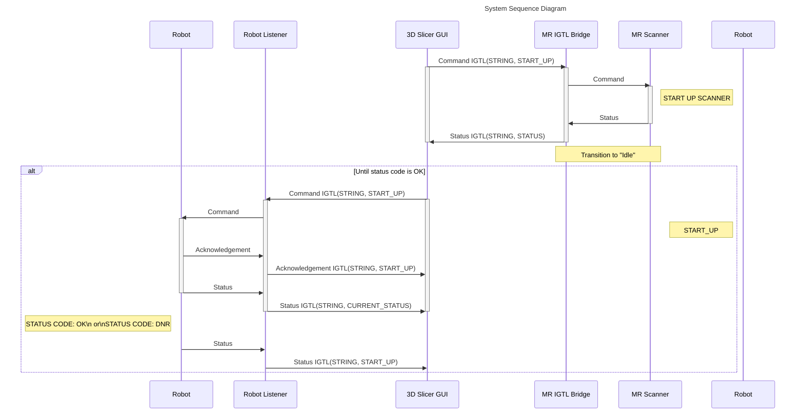
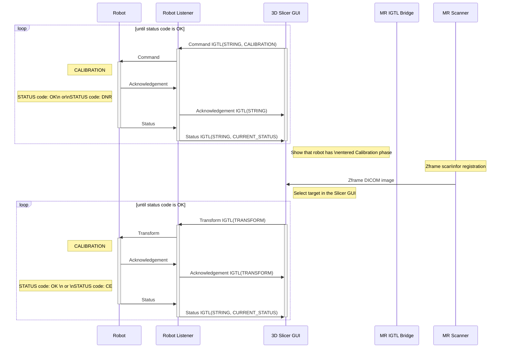
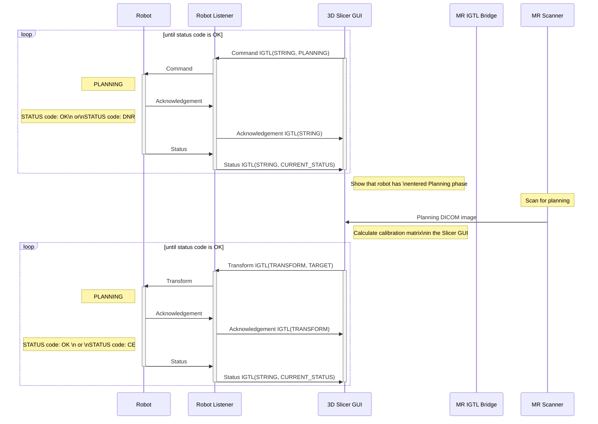
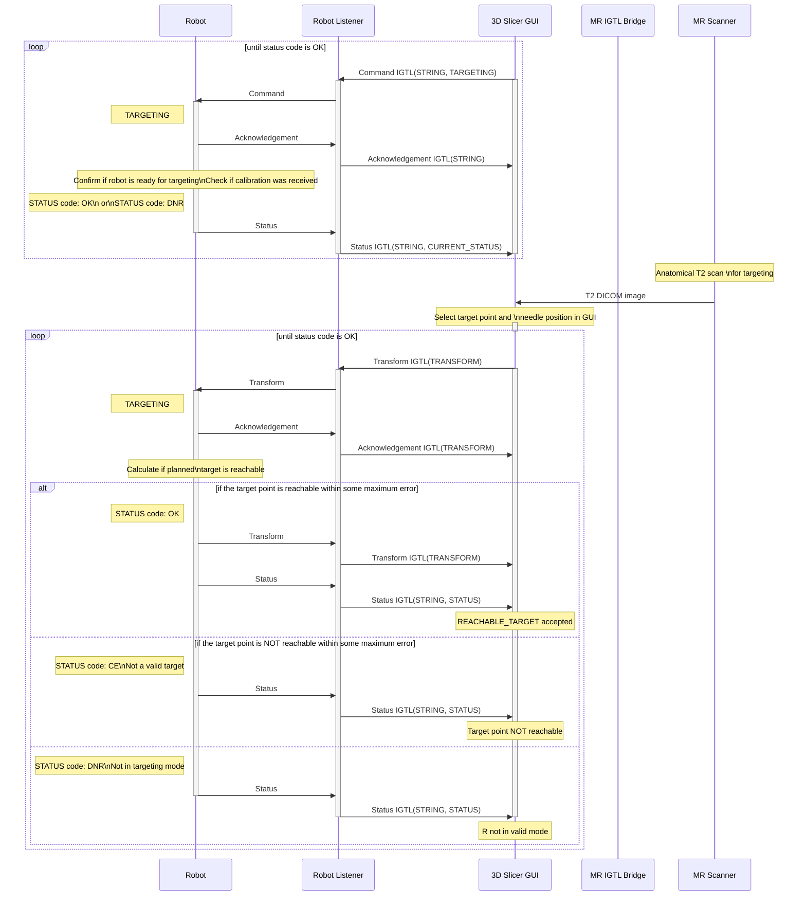
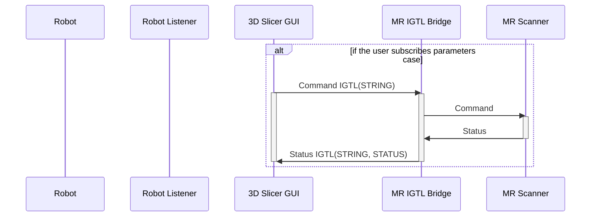
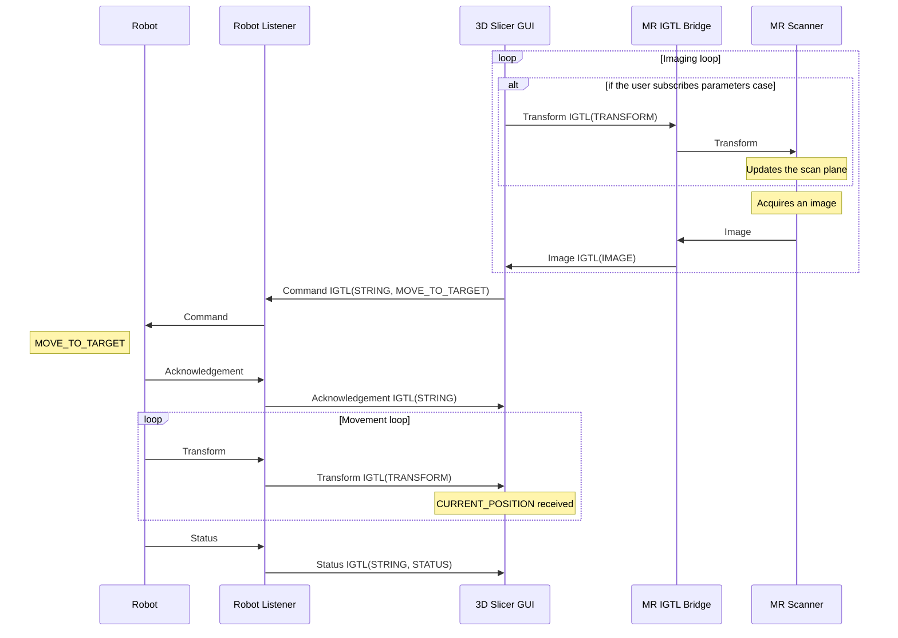

Sequence Diagram
================

Initialization
--------------

Patient set up in bore
----------------------

Calibration
-----------

Planning
-----------

Targeting
---------------

Idle
----

Scan & Move
-----------

                                                                        
