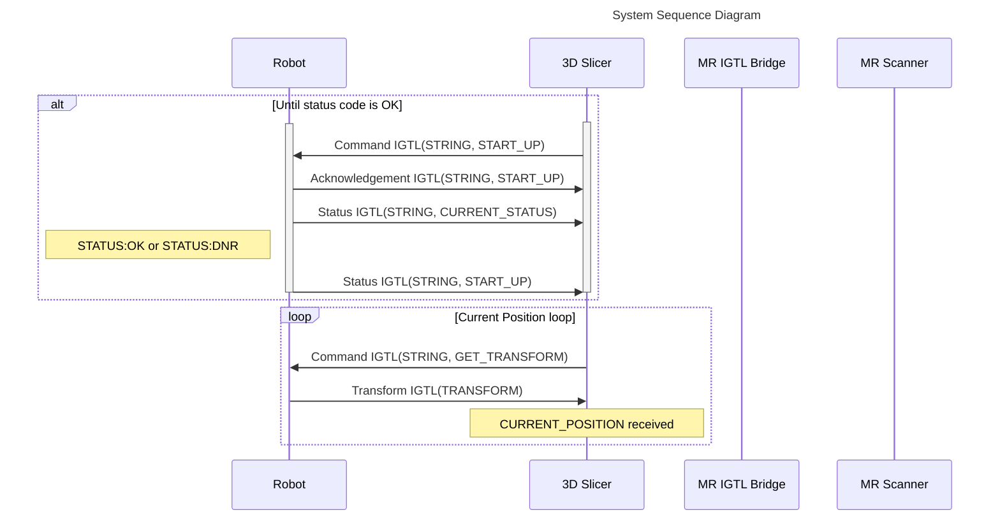
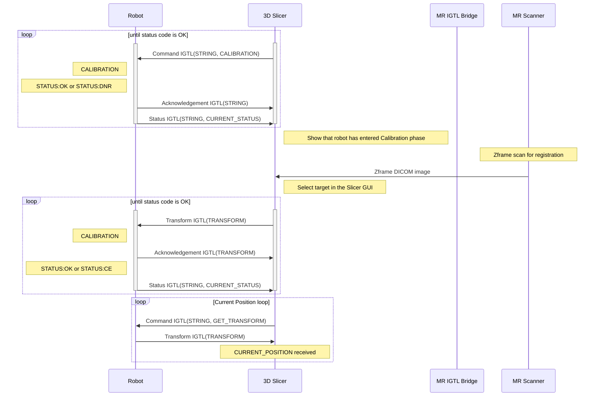
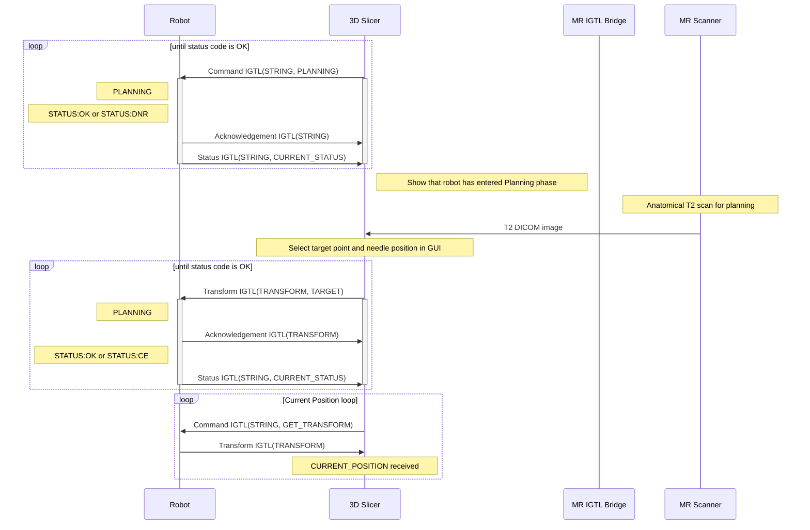
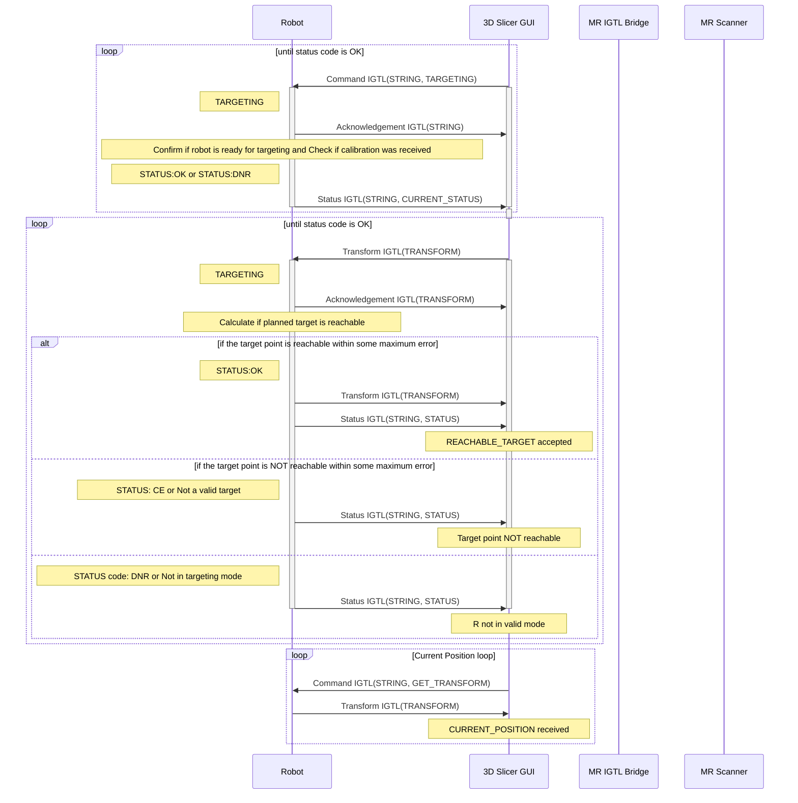
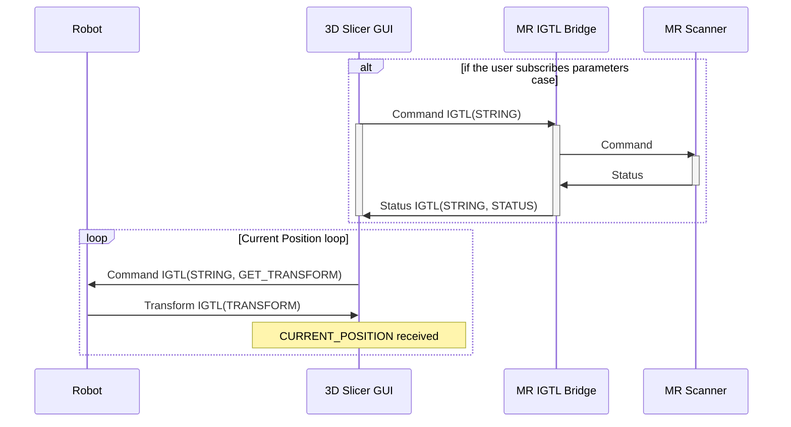
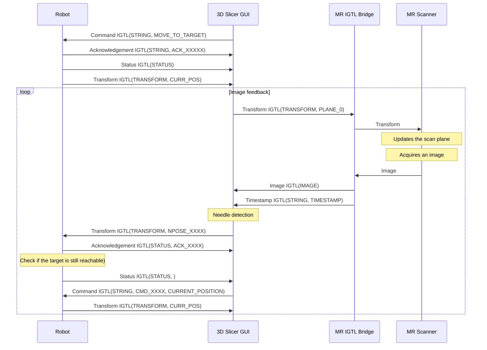
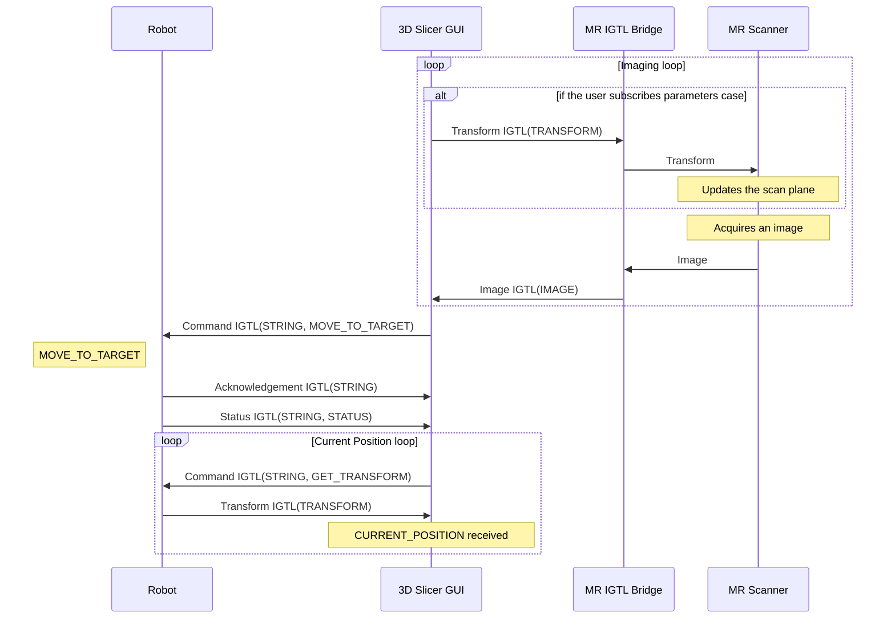

Sequence Diagram
================

Initialization
--------------

Patient set up in bore
----------------------

Calibration
-----------

Planning
-----------

Targeting
---------------

Idle
----

Scan & Move (Revised on Feb 23, 2023)
-----------

Scan & Move (Obsolete)
-----------

                                                                        
