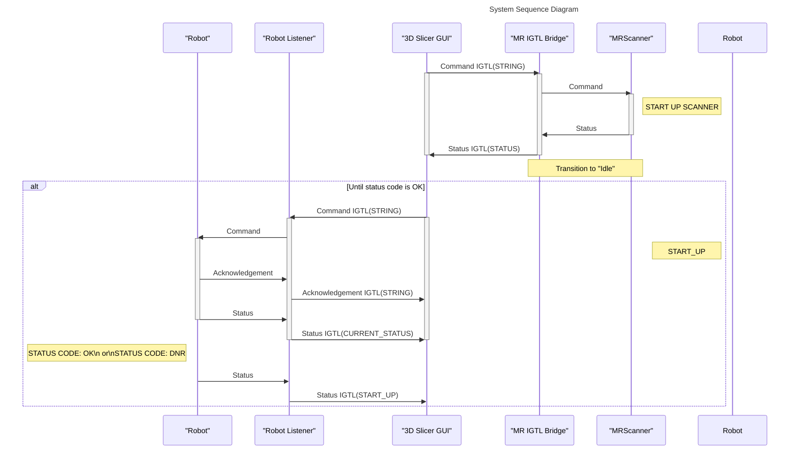
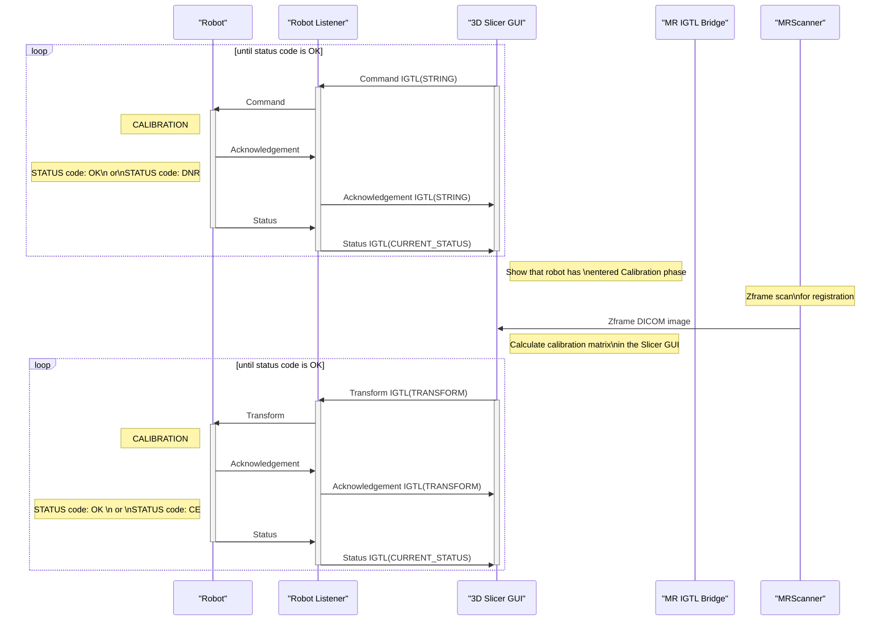
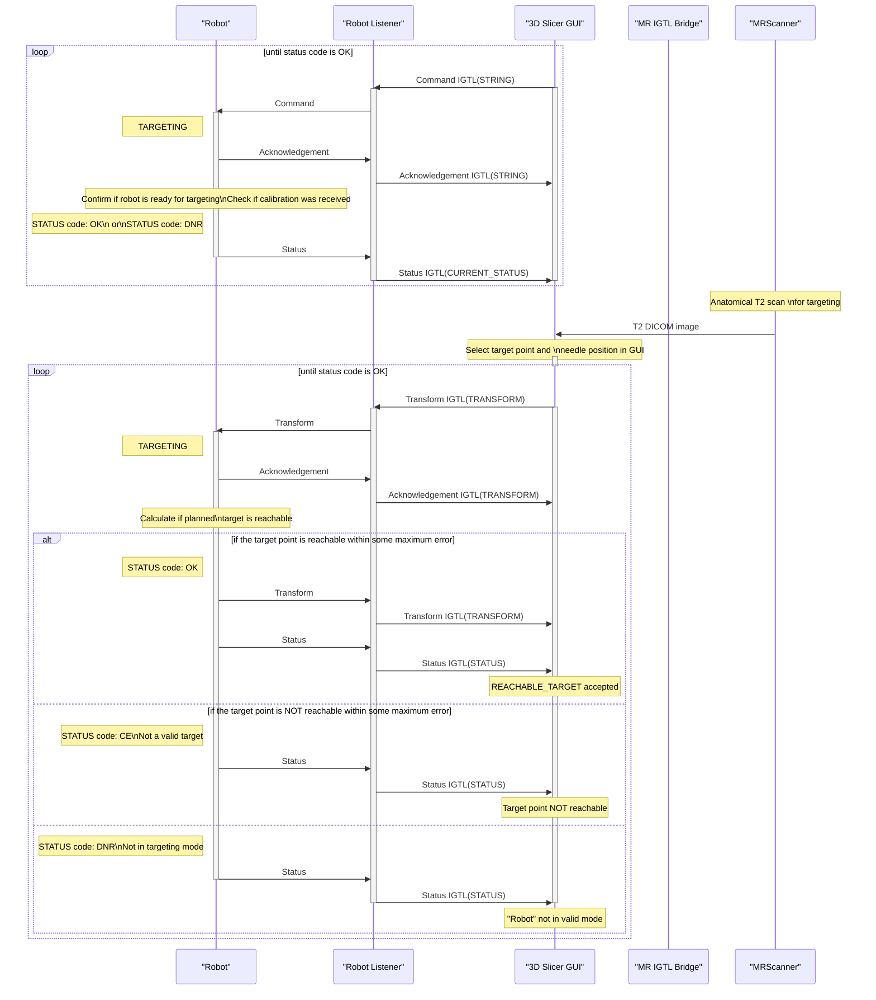
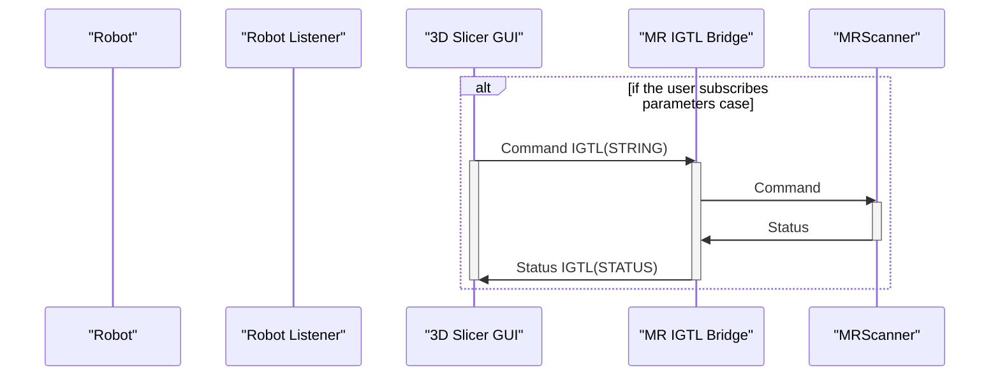
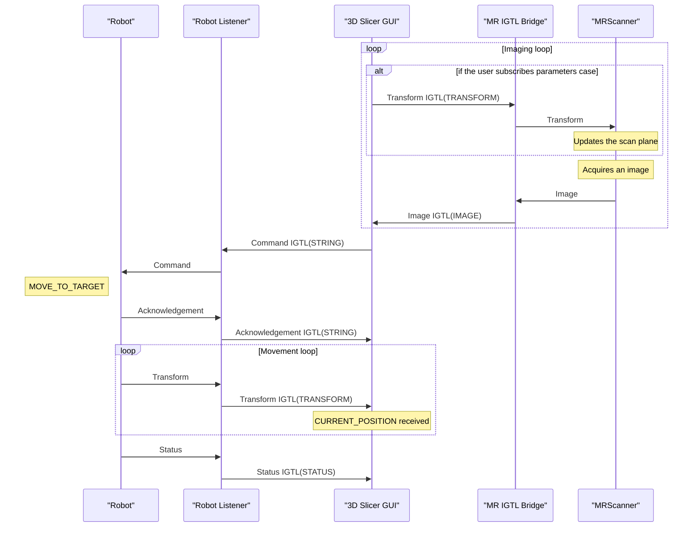

Sequence Diagram
================

Initialization
--------------

Patient set up in bore
----------------------

Calibration
-----------

Target planning
---------------

Idle
----

Scan & Move
-----------

                                                                        
