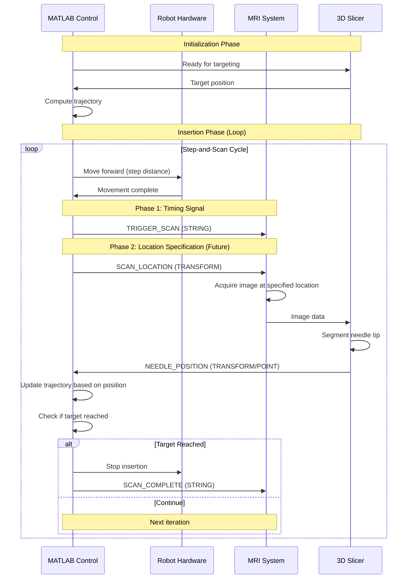
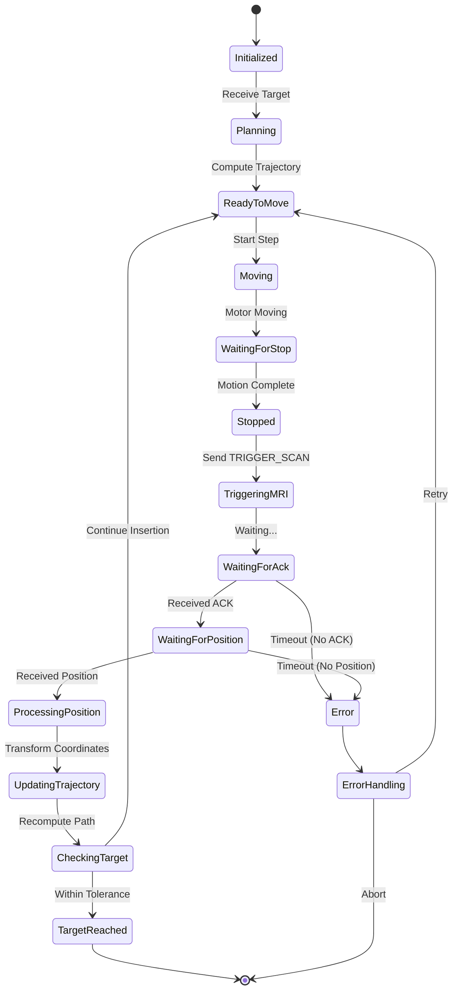

# MRI Needle Tip Position Feedback Integration Proposal
## Step-and-Scan Workflow with Bidirectional Communication

**Date**: December 10, 2025  
**Project**: BRP Robot MATLAB Control System  
**Purpose**: Enable step-and-scan MRI feedback control with bidirectional communication for imaging coordination

---

## Table of Contents
1. [Executive Summary](#executive-summary)
2. [Workflow Overview: Step-and-Scan Approach](#workflow-overview-step-and-scan-approach)
3. [MRI Integration Team Responsibilities](#mri-integration-team-responsibilities)
4. [Current System Analysis](#current-system-analysis)
5. [Proposed Architecture](#proposed-architecture)
6. [Implementation Strategy - Phased Approach](#implementation-strategy---phased-approach)
7. [MATLAB Components](#matlab-components)
8. [OpenIGTLink Communication Protocol](#openigtlink-communication-protocol)
9. [Required Modifications](#required-modifications)
10. [New Functions Specification](#new-functions-specification)
11. [Integration with Control Loop](#integration-with-control-loop)
12. [Testing and Validation Plan](#testing-and-validation-plan)
13. [Timeline and Milestones](#timeline-and-milestones)

---

## Executive Summary

This proposal outlines a **step-and-scan MRI feedback control system** for needle insertion. The workflow involves:
1. **Robot inserts needle** a specified distance
2. **Robot stops and signals MRI** for imaging
3. **MRI acquires image** at specified location
4. **MRI sends needle position** to MATLAB via OpenIGTLink
5. **MATLAB adjusts trajectory** and repeats

The system is designed with **phased implementation**:
- **Phase 1 (Minimum)**: Timing signals only (MATLAB → MRI)
- **Phase 2 (Enhanced)**: Imaging location specification (MATLAB → MRI)
- **Phase 3 (Advanced)**: Bidirectional real-time coordination

### Key Design Principles:
1. **Stepwise Implementation**: Start with timing, add location control incrementally
2. **Flexibility**: Support multiple message types and communication patterns
3. **Clear Team Separation**: Well-defined interface between MATLAB and MRI teams
4. **Robustness**: Graceful degradation and timeout handling
5. **Testability**: Simulation mode for development without hardware

---

## Workflow Overview: Step-and-Scan Approach

### Clinical Workflow



### Step-and-Scan Parameters

**Timing Parameters**:
```matlab
step_distance = 5-10 mm        % Distance to move per step
scan_wait_time = 2-5 sec       % Wait time before triggering scan
mri_timeout = 30 sec           % Maximum wait for MRI response
position_timeout = 60 sec      % Maximum wait for position data
```

**Key Characteristics**:
- **Discrete Motion**: Robot moves, stops completely, then MRI scans
- **No Motion Artifacts**: MRI imaging occurs during complete stillness
- **Coordinated**: Explicit handshaking between MATLAB and MRI systems
- **Robust**: Timeout protection at each step

---

## MRI Integration Team Responsibilities

### Overview for MRI Team

**Your Role**: Implement MRI-side communication and imaging control via OpenIGTLink

**Our Role** (MATLAB Team): Robot control, trajectory planning, position processing

**Interface**: OpenIGTLink protocol for bidirectional communication

### Phase 1 Requirements (Minimum Viable Product)

#### 1.1 Receive Scan Trigger from MATLAB

**What to Implement**:
- OpenIGTLink server/client to receive STRING messages from MATLAB
- Listen for `"TRIGGER_SCAN"` command
- Trigger MRI image acquisition upon receiving command

**Message Format**:
```
Type: STRING
Device Name: "SCAN_TRIGGER"
Content: "TRIGGER_SCAN"
```

**Expected Behavior**:
1. MATLAB sends `TRIGGER_SCAN` when robot stops
2. Your system initiates MRI scan
3. Scan completes and image is processed
4. Needle position is sent back to MATLAB (see 1.2)

**Timing Requirements**:
- Acknowledge receipt within 1 second
- Complete scan and return position within MRI acquisition time + processing time

---

#### 1.2 Send Needle Position to MATLAB

**What to Implement**:
- Segment needle tip from acquired MRI image
- Send needle tip position via OpenIGTLink to MATLAB

**Message Format Options** (Choose ONE that works for your system):

**Option A: TRANSFORM Message** (Preferred if you have full 6-DOF pose)
```
Type: TRANSFORM
Device Name: "NEEDLE_TIP"
Content: 4x4 transformation matrix
  [R11 R12 R13 Tx]   // Tx, Ty, Tz in mm (RAS coordinates)
  [R21 R22 R23 Ty]
  [R31 R32 R33 Tz]
  [  0   0   0  1]
```

**Option B: POINT Message** (Simpler, position only)
```
Type: POINT
Device Name: "NEEDLE_TIP"
Content: Point list with [x, y, z] in mm (RAS coordinates)
```

**Option C: Custom Format** (If A and B don't work for you)
- Please specify your preferred format
- We will create custom parser on MATLAB side

**Coordinate System Requirements**:
- **Must use**: RAS (Right-Anterior-Superior) coordinate system
  - X: Patient's right (+) / left (-)
  - Y: Patient's anterior (+) / posterior (-)
  - Z: Patient's superior (+) / inferior (-)
- **Units**: Millimeters (mm)
- **Origin**: Same as image volume origin used in 3D Slicer

**Quality/Confidence Metrics** (Optional but helpful):
- If your segmentation provides confidence/quality score, include it
- Methods:
  - Add to POINT message metadata
  - Send separate STRING message with quality value
  - Include in custom TRANSFORM metadata

---

#### 1.3 Error Handling Requirements

**What to Implement**:

1. **Acknowledge Trigger**:
   ```
   Type: STRING
   Device Name: "SCAN_STATUS"
   Content: "ACK_TRIGGER" or "SCAN_STARTED"
   ```

2. **Report Scan Completion**:
   ```
   Type: STRING
   Device Name: "SCAN_STATUS"
   Content: "SCAN_COMPLETE"
   ```

3. **Report Errors**:
   ```
   Type: STRING
   Device Name: "SCAN_STATUS"
   Content: "ERROR: <description>"
   
   Examples:
   - "ERROR: Segmentation failed"
   - "ERROR: No needle visible"
   - "ERROR: MRI scanner not ready"
   ```

4. **Timeout Handling**:
   - If scan cannot complete within timeout, send error message
   - MATLAB will wait maximum 60 seconds before declaring timeout

---

### Phase 2 Requirements (Enhanced - Future)

#### 2.1 Receive Imaging Location from MATLAB

**What to Implement**:
- Receive imaging plane/volume location from MATLAB
- Adjust MRI scan parameters to image specified region

**Message Format**:
```
Type: TRANSFORM
Device Name: "SCAN_LOCATION"
Content: 4x4 transformation matrix defining imaging plane center and orientation

OR

Type: POINT
Device Name: "SCAN_LOCATION" 
Content: Center point [x, y, z] of region to scan
```

**Expected Behavior**:
1. MATLAB computes optimal imaging location (near needle tip)
2. MATLAB sends SCAN_LOCATION before TRIGGER_SCAN
3. Your system adjusts scan parameters (slice position, orientation)
4. Scan proceeds at specified location

**Benefits**:
- Reduced scan time (smaller region of interest)
- Better image quality (optimized for needle region)
- Faster feedback loop

---

### Phase 3 Requirements (Advanced - Future)

#### 3.1 Advanced Coordination

**Potential Features**:
- Dynamic scan parameter adjustment based on needle position
- Multi-slice acquisition for better 3D localization
- Real-time scan progress updates
- Adaptive scan quality based on motion

**To Be Defined**:
- Specific requirements based on Phase 1 & 2 experience

---

### Decisions Required from MRI Team

Please provide the following information to proceed:

#### Critical Decisions (Phase 1 - Needed Immediately):

1. **OpenIGTLink Configuration**:
   - [ ] Will your system act as OpenIGTLink **Server** or **Client**?
     - Server: MRI system listens for connections (needs IP:Port)
     - Client: MRI system connects to MATLAB (MATLAB provides IP:Port)
   - [ ] Preferred IP address: `__________`
   - [ ] Preferred port: `________` (default: 18944, different from Slicer's 18936)

2. **Message Format Selection**:
   - [ ] TRANSFORM (full 4x4 matrix)
   - [ ] POINT (position only)
   - [ ] CUSTOM (please specify format)
   - [ ] **Device Name** you will use for needle position: `__________`

3. **Timing Specifications**:
   - [ ] Typical MRI scan duration: `______` seconds
   - [ ] Needle segmentation processing time: `______` seconds
   - [ ] Total time from trigger to position available: `______` seconds
   - [ ] Can you provide scan progress updates? Yes / No

4. **Segmentation Method**:
   - [ ] Manual segmentation in Slicer
   - [ ] Semi-automatic in Slicer (which module?)
   - [ ] Automatic algorithm (describe briefly)
   - [ ] Other: `__________`

5. **Coordinate System Confirmation**:
   - [ ] Confirm output will be in RAS coordinates (Right-Anterior-Superior)
   - [ ] Confirm units will be millimeters (mm)
   - [ ] Confirm origin matches 3D Slicer image origin
   - [ ] If different, please specify: `__________`

6. **Error Conditions**:
   What error conditions should we expect?
   - [ ] Needle not visible in image
   - [ ] Segmentation confidence too low
   - [ ] MRI scanner busy/not ready
   - [ ] Other: `__________`

#### Optional Decisions (Phase 2 - Can Decide Later):

7. **Imaging Location Control**:
   - [ ] Interested in receiving scan location from MATLAB? Yes / No / Maybe
   - [ ] Can your system adjust imaging plane based on coordinates? Yes / No
   - [ ] Preferred format for location specification: TRANSFORM / POINT / Other

8. **Quality Metrics**:
   - [ ] Can you provide segmentation confidence score? Yes / No
   - [ ] Method for sending confidence: Metadata / Separate message
   - [ ] Confidence scale: 0-1 / 0-100 / Other

9. **Advanced Features**:
   - [ ] Real-time scan progress updates available? Yes / No
   - [ ] Can interrupt/abort scan if needed? Yes / No
   - [ ] Multi-slice acquisition supported? Yes / No

---

### Testing Support from MATLAB Team

**We Will Provide**:

1. **OpenIGTLink Test Client/Server**:
   - Simple MATLAB script to send TRIGGER_SCAN commands
   - Script to receive and display position data
   - Message format validators

2. **Message Examples**:
   - Sample TRIGGER_SCAN messages
   - Sample NEEDLE_POSITION messages (all formats)
   - Sample error messages

3. **Documentation**:
   - OpenIGTLink protocol reference
   - Coordinate system transformation guides
   - Troubleshooting guide

4. **Testing Protocol**:
   - Step-by-step testing procedure
   - Expected behavior documentation
   - Communication verification checklist

**You Should Provide**:

1. **Test Endpoint**:
   - IP address and port for testing
   - Schedule/availability for joint testing

2. **Test Data**:
   - Sample MRI images with visible needle
   - Known needle positions for validation

3. **Response Times**:
   - Measured timing data for scan + segmentation

---

### Communication Protocol Summary

**MATLAB → MRI (Commands)**:

| Phase | Message Type | Device Name | Content | Purpose |
|-------|-------------|-------------|---------|---------|
| 1 | STRING | SCAN_TRIGGER | "TRIGGER_SCAN" | Request MRI scan |
| 1 | STRING | SCAN_CONTROL | "STOP_SCAN" | Abort scanning |
| 1 | STRING | SCAN_CONTROL | "RESET" | Reset MRI state |
| 2 | TRANSFORM | SCAN_LOCATION | 4x4 matrix | Specify imaging region |
| 2 | POINT | SCAN_LOCATION | [x,y,z] | Specify imaging center |

**MRI → MATLAB (Data & Status)**:

| Phase | Message Type | Device Name | Content | Purpose |
|-------|-------------|-------------|---------|---------|
| 1 | STRING | SCAN_STATUS | "ACK_TRIGGER" | Acknowledge scan request |
| 1 | STRING | SCAN_STATUS | "SCAN_COMPLETE" | Scan finished |
| 1 | STRING | SCAN_STATUS | "ERROR: ..." | Error notification |
| 1 | TRANSFORM | NEEDLE_TIP | 4x4 matrix | Needle pose (full) |
| 1 | POINT | NEEDLE_TIP | [x,y,z] | Needle position (simple) |
| 2 | STRING | SCAN_STATUS | "PROGRESS: 50%" | Scan progress update |

---

### Existing Control Modes

**Open-Loop Control** (`open_loop = true`):
- Uses encoder feedback only (rotation + insertion depth)
- Pre-computed trajectory based on kinematic model
- Currently functional and stable
- Executed via `move_to_end()` method

**Closed-Loop Control** (`open_loop = false`):
- Currently **partially implemented**
- Expects needle pose from MRI via `move_A_step(needle_pos_image)`
- Called iteratively from `Server.onMove()`
- **Gap**: No actual MRI data reception mechanism

### Current Sensor Data Flow

```
┌─────────────────────────────────────────────────────────┐
│              Current Sensor Architecture                │
└─────────────────────────────────────────────────────────┘

Encoders (Hardware)
    ↓
get_encoder_tick() / get_encoder_insertion()
    ↓
obj.zRotation, obj.zInsertion
    ↓
obj.Needle_pose_sensor_realtime [updated in Control_CB]
    ↓
Extended Kalman Filter (optional)
    ↓
obj.Needle_pose_act [used for control]
```

## Current System Analysis

### Existing Control Modes

**Open-Loop Control** (`open_loop = true`):
- Uses encoder feedback only (rotation + insertion depth)
- Pre-computed trajectory based on kinematic model
- Currently functional and stable
- Executed via `move_to_end()` method

**Closed-Loop Control** (`open_loop = false`):
- Currently **partially implemented**
- Designed for continuous MRI feedback
- Called iteratively from `Server.onMove()`
- **Will be adapted for step-and-scan workflow**

### Current Sensor Data Flow

```
┌─────────────────────────────────────────────────────────┐
│              Current Sensor Architecture                │
└─────────────────────────────────────────────────────────┘

Encoders (Hardware)
    ↓
get_encoder_tick() / get_encoder_insertion()
    ↓
obj.zRotation, obj.zInsertion
    ↓
obj.Needle_pose_sensor_realtime [updated in Control_CB]
    ↓
Extended Kalman Filter (optional)
    ↓
obj.Needle_pose_act [used for control]
```

### Gap Analysis for Step-and-Scan

**Current Gaps**:
1. **No MRI Trigger Mechanism**: Cannot signal MRI to start scanning
2. **No Scan Synchronization**: No handshaking protocol with MRI
3. **No Step-based Movement**: Current code moves continuously
4. **No Position Reception**: No mechanism to receive needle position from MRI
5. **No Timeout Handling**: No timeout for waiting for MRI response

**Required Changes**:
1. Implement step-based movement control
2. Add MRI trigger signal transmission
3. Add MRI position reception and parsing
4. Implement synchronization state machine
5. Add timeout and error handling

---

## Proposed Architecture

### High-Level System Architecture

```
┌──────────────────────────────────────────────────────────────────────┐
│                    Step-and-Scan Architecture                        │
└──────────────────────────────────────────────────────────────────────┘

┌─────────────────────────────────────────────────────────────────────┐
│  MATLAB Control System                                              │
│  ┌───────────────────────────────────────────────────────────────┐ │
│  │  Step-and-Scan Controller (NEW)                               │ │
│  │  - Compute step distances                                     │ │
│  │  - Trigger MRI scans                                          │ │
│  │  - Wait for position feedback                                 │ │
│  │  - Update trajectory                                          │ │
│  └───────────────────────────────────────────────────────────────┘ │
│         ↓ Commands                               ↑ Feedback         │
│  ┌──────────────────┐                    ┌─────────────────────┐   │
│  │ Robot Control    │                    │ MRI Comm Manager    │   │
│  │ (Existing)       │                    │ (NEW)               │   │
│  └──────────────────┘                    └─────────────────────┘   │
└─────────────────────────────────────────────────────────────────────┘
         │                                           │
         ↓                                           ↓
┌──────────────────┐                    ┌────────────────────────────┐
│ Robot Hardware   │                    │   OpenIGTLink Network      │
│ (Motors/Encoders)│                    │                            │
└──────────────────┘                    └────────────────────────────┘
                                                     │
                                                     ↓
                                        ┌────────────────────────────┐
                                        │  MRI System + 3D Slicer    │
                                        │  (MRI Team Responsibility) │
                                        │  - Receive triggers        │
                                        │  - Acquire images          │
                                        │  - Segment needle          │
                                        │  - Send position           │
                                        └────────────────────────────┘
```

### Step-and-Scan State Machine



### Data Flow for One Step-and-Scan Cycle

```
┌─────────────────────────────────────────────────────────────────┐
│  Step N Cycle (typical duration: 10-60 seconds)                │
└─────────────────────────────────────────────────────────────────┘

1. MATLAB: Compute next step distance (5-10 mm)
   ↓ [0.1 sec]
   
2. MATLAB → Robot: Move forward command
   ↓ [1-3 sec]
   
3. Robot: Execute motion, report complete
   ↓ [0.5 sec]
   
4. MATLAB: Wait for stabilization
   ↓ [0.1 sec]
   
5. MATLAB → MRI: Send "TRIGGER_SCAN" (STRING)
   ↓ [0.1 sec]
   
6. MRI → MATLAB: Send "ACK_TRIGGER" (STRING)
   ↓ [10-30 sec]
   
7. MRI: Acquire image and segment needle
   ↓ [0.1 sec]
   
8. MRI → MATLAB: Send "SCAN_COMPLETE" (STRING)
   ↓ [0.1 sec]
   
9. MRI → MATLAB: Send needle position (TRANSFORM/POINT)
   ↓ [0.5 sec]
   
10. MATLAB: Process position, update trajectory
    ↓ [0.1 sec]
    
11. MATLAB: Check if target reached
    ↓
    
12. If NOT reached: Go to step 1 (next cycle)
    If reached: Stop and complete
```

---

## Implementation Strategy - Phased Approach

### Phase 1: Timing Signals Only (Weeks 1-3)

**Goal**: Establish basic step-and-scan workflow with timing coordination

**MATLAB Implementation**:
- Step-based movement control
- Send TRIGGER_SCAN to MRI
- Wait for position response
- Basic timeout handling

**MRI Team Implementation**:
- Receive TRIGGER_SCAN
- Return ACK
- Perform scan
- Return position (TRANSFORM or POINT)

**Imaging Region**: MRI team decides scan location (e.g., fixed slice, whole volume)

**Success Criteria**:
- ✓ Robot steps forward 5-10 mm
- ✓ MATLAB triggers MRI scan
- ✓ MRI returns needle position
- ✓ MATLAB receives and logs position
- ✓ Process repeats until target

---

### Phase 2: Location Specification (Weeks 4-6)

**Goal**: MATLAB specifies optimal imaging location to MRI

**MATLAB Enhancement**:
- Compute optimal scan location (near needle tip)
- Send SCAN_LOCATION before trigger
- Adaptive scan region sizing

**MRI Team Enhancement**:
- Receive SCAN_LOCATION
- Adjust imaging parameters (slice position, FOV)
- Scan at specified location

**Benefits**:
- Faster scans (smaller region)
- Better image quality
- More efficient workflow

**Success Criteria**:
- ✓ MATLAB computes scan location
- ✓ MRI adjusts scan to specified region
- ✓ Scan time reduced by 30-50%
- ✓ Image quality maintained or improved

---

### Phase 3: Advanced Coordination (Weeks 7-10)

**Goal**: Optimize workflow with real-time coordination

**Potential Features**:
- Scan progress updates
- Adaptive step sizes based on error
- Multi-slice acquisition
- Quality-based rescanning

**To Be Determined**: Based on Phase 1 & 2 experience

---

## MATLAB Components

### New Class: `StepAndScanController`

**Purpose**: Orchestrates the step-and-scan workflow

```matlab
classdef StepAndScanController < handle
    %STEPANDSCANCONTROLLER Manages step-and-scan MRI feedback workflow
    %   Coordinates robot stepping, MRI triggering, and position feedback
    
    properties (Access = public)
        % Configuration
        step_distance = 5                 % Step distance [mm]
        min_step_distance = 2             % Minimum step [mm]
        max_step_distance = 15            % Maximum step [mm]
        adaptive_stepping = false         % Adjust step based on error
        
        % Timing parameters
        scan_wait_time = 2.0              % Wait before triggering scan [sec]
        mri_ack_timeout = 5.0             % Timeout for MRI acknowledgment [sec]
        mri_position_timeout = 60.0       % Timeout for position data [sec]
        stabilization_time = 0.5          % Wait after motion stops [sec]
        
        % State tracking
        current_state = 'INITIALIZED'     % State machine state
        step_number = 0                   % Current step count
        total_insertion_distance = 0      % Total inserted distance [mm]
        
        % Position data
        needle_positions_history          % History of MRI positions
        step_distances_history            % History of step distances
        step_times_history                % Timing data for each step
        
        % MRI communication
        mri_comm_manager                  % MRI communication manager
        last_mri_trigger_time             % Last trigger timestamp
        last_mri_response_time            % Last response timestamp
        
        % Error tracking
        mri_timeout_count = 0             % Number of MRI timeouts
        max_timeout_retries = 3           % Max retries before abort
        
        % Phase 2 properties (imaging location)
        enable_location_specification = false  % Phase 2 feature flag
        scan_location_buffer = 10         % Buffer around needle tip [mm]
    end
    
    methods
        function obj = StepAndScanController(varargin)
            %Constructor
        end
        
        function executeStepAndScan(obj, robot, target_position)
            %EXECUTESTEPANDSCAN Main step-and-scan loop
        end
        
        function success = executeOneStep(obj, robot, current_position, target_position)
            %EXECUTEONESTEP Execute one step-scan-feedback cycle
        end
        
        function triggerMRIScan(obj)
            %TRIGGERMRISCAN Send trigger signal to MRI
        end
        
        function [position, quality] = waitForMRIPosition(obj)
            %WAITFORMRIPOSITION Wait for MRI position with timeout
        end
        
        function distance = computeNextStep(obj, current_pos, target_pos, error_magnitude)
            %COMPUTENEXTSTEP Compute optimal step distance
        end
        
        % Phase 2 methods
        function sendScanLocation(obj, location)
            %SENDSCANLOCATION Send imaging location to MRI (Phase 2)
        end
    end
end
```

### New Class: `MRICommunicationManager`

**Purpose**: Handle all OpenIGTLink communication with MRI system

```matlab
classdef MRICommunicationManager < handle
    %MRICOMMUNICATIONMANAGER Bidirectional communication with MRI system
    %   Sends triggers and location specifications
    %   Receives needle positions and status messages
    
    properties (Access = public)
        % Connection settings (provided by MRI team)
        mri_host = '127.0.0.1'            % MRI system IP address
        mri_port = 18944                  % MRI system port (different from Slicer)
        connection_mode = 'CLIENT'        % 'CLIENT' or 'SERVER'
        
        % Device names (agreed with MRI team)
        trigger_device_name = 'SCAN_TRIGGER'
        status_device_name = 'SCAN_STATUS'
        position_device_name = 'NEEDLE_TIP'
        location_device_name = 'SCAN_LOCATION'
        
        % Message format (determined by MRI team)
        position_message_type = 'TRANSFORM'  % 'TRANSFORM', 'POINT', or 'CUSTOM'
        
        % Communication objects
        socket                            % OpenIGTLink socket
        sender                            % Message sender
        receiver                          % Message receiver
        
        % State
        is_connected = false
        last_sent_message                 % Last message sent
        last_received_message             % Last message received
        message_log                       % Communication log
        
        % Callbacks
        onPositionReceived                % Callback for position data
        onStatusReceived                  % Callback for status messages
        onError                           % Callback for errors
    end
    
    methods
        function obj = MRICommunicationManager(varargin)
            %Constructor with flexible configuration
        end
        
        function success = connect(obj)
            %CONNECT Establish connection to MRI system
        end
        
        function disconnect(obj)
            %DISCONNECT Close connection
        end
        
        function sendTriggerScan(obj)
            %SENDTRIGGERSCAN Send TRIGGER_SCAN command to MRI
            %   Type: STRING
            %   Device: SCAN_TRIGGER
            %   Content: "TRIGGER_SCAN"
        end
        
        function sendStopScan(obj)
            %SENDSTOPSCAN Send abort command to MRI
        end
        
        function sendScanLocation(obj, location_transform)
            %SENDSCANLOCATION Send imaging location (Phase 2)
            %   Type: TRANSFORM or POINT
            %   Device: SCAN_LOCATION
            %   Content: 4x4 matrix or [x,y,z]
        end
        
        function [status, message] = waitForAcknowledgment(obj, timeout)
            %WAITFORACKNOWLEDGMENT Wait for ACK_TRIGGER from MRI
        end
        
        function [position, quality] = waitForPosition(obj, timeout)
            %WAITFORPOSITION Wait for needle position from MRI
        end
        
        function [status, message] = receiveStatusMessage(obj)
            %RECEIVESTATUSMESSAGE Receive status updates from MRI
        end
        
        function success = testConnection(obj)
            %TESTCONNECTION Verify MRI communication is working
        end
    end
end
```

### Enhanced Class: `MRIPositionManager`

**Purpose**: Parse and validate position data from MRI (adapted for step-and-scan)

```matlab
classdef MRIPositionManager < handle
    %MRIPOSITIONMANAGER Flexible receiver for MRI needle tip position
    %   Adapted for step-and-scan workflow with discrete updates
    
    properties (Access = public)
        % Configuration
        expected_message_type = 'AUTO'    % 'AUTO', 'TRANSFORM', 'POINT', 'CUSTOM'
        device_name_filter = 'NEEDLE'     % Filter by device name
        coordinate_system = 'RAS'         % 'RAS' (Slicer) or 'LPS'
        
        % Reception state
        last_position = []                % [x, y, z] in mm (image frame)
        last_orientation = []             % [3x3] rotation matrix
        last_full_transform = eye(4)      % [4x4] homogeneous transform
        last_timestamp                    % Reception time
        last_step_number = 0              % Step number for this position
        
        % Quality metrics
        is_valid = false                  % Data validity flag
        confidence = 0.0                  % Confidence score [0-1]
        
        % Statistics (per-step, not continuous)
        positions_received = 0            % Total positions received
        invalid_positions = 0             % Invalid/rejected positions
        average_quality = 0               % Running average quality
        
        % Parsers (plugin architecture)
        parsers                           % Map of message type → parser function
        active_parser                     % Currently active parser
        
        % Validation
        max_position_change = 20          % Max position change per step [mm]
        min_confidence = 0.3              % Minimum acceptable confidence
    end
    
    methods
        function obj = MRIPositionManager(varargin)
            % Constructor
            obj.parsers = containers.Map();
            obj.registerDefaultParsers();
        end
        
        function [position, orientation, quality] = receivePosition(obj, message_type, message_data, device_name)
            %RECEIVEPOSITION Process position message from MRI
        end
        
        function registerParser(obj, message_type, parser_func)
            %REGISTERPARSER Add custom parser
        end
        
        function valid = validatePosition(obj, position, previous_position)
            %VALIDATEPOSITION Check if position is physically reasonable
        end
        
        function [pos, confidence] = getLatestPosition(obj)
            %GETLATESTPOSITION Get most recent validated position
        end
    end
end
```

---

## OpenIGTLink Communication Protocol

### Message Specifications

#### Phase 1 Messages

**1. TRIGGER_SCAN (MATLAB → MRI)**

```matlab
% How to send from MATLAB:
mri_comm.sender.WriteOpenIGTLinkStringMessage('SCAN_TRIGGER', 'TRIGGER_SCAN');
```

**OpenIGTLink Format**:
```
Header:
  Version: 2
  Data Type: STRING
  Device Name: "SCAN_TRIGGER"
  
Body:
  Encoding: UTF-8 (code 3)
  Length: 12
  String: "TRIGGER_SCAN"
```

---

**2. ACK_TRIGGER (MRI → MATLAB)**

```
Header:
  Version: 2
  Data Type: STRING
  Device Name: "SCAN_STATUS"
  
Body:
  Encoding: UTF-8 (code 3)
  String: "ACK_TRIGGER" or "SCAN_STARTED"
```

---

**3. NEEDLE_POSITION - TRANSFORM Format (MRI → MATLAB)**

```
Header:
  Version: 2
  Data Type: TRANSFORM
  Device Name: "NEEDLE_TIP"
  
Body: (48 bytes)
  12 x 4-byte floats representing 4x4 matrix (row-major, last row omitted):
  
  [R11 R12 R13 Tx]
  [R21 R22 R23 Ty]
  [R31 R32 R33 Tz]
  [ 0   0   0   1]  (implicit)
  
  Where:
    Rij = Rotation matrix elements
    Tx, Ty, Tz = Position in mm (RAS coordinates)
```

**How to receive in MATLAB**:
```matlab
% Automatic reception via callback
function obj = onRxTransformMessage(obj, deviceName, transform)
    if contains(deviceName, 'NEEDLE')
        position = transform(1:3, 4);  % Extract position
        % Process position...
    end
end
```

---

**4. NEEDLE_POSITION - POINT Format (MRI → MATLAB)**

```
Header:
  Version: 2
  Data Type: POINT
  Device Name: "NEEDLE_TIP"
  
Body: (136 bytes per point)
  Name: (64 bytes) "Needle_Tip_Position"
  Group: (32 bytes) "Needle"
  RGBA: (4 bytes) Color code
  X: (4 bytes) float - X position in mm
  Y: (4 bytes) float - Y position in mm  
  Z: (4 bytes) float - Z position in mm
  Diameter: (4 bytes) float
  Owner: (20 bytes) "MRI_System"
```

**How to receive in MATLAB**:
```matlab
function obj = onRxPointMessage(obj, deviceName, pointList)
    if contains(deviceName, 'NEEDLE')
        position = pointList(1, :);  % First point [x, y, z]
        % Process position...
    end
end
```

---

**5. SCAN_COMPLETE (MRI → MATLAB)**

```
Header:
  Version: 2
  Data Type: STRING
  Device Name: "SCAN_STATUS"
  
Body:
  String: "SCAN_COMPLETE"
```

---

**6. ERROR Messages (MRI → MATLAB)**

```
Header:
  Version: 2
  Data Type: STRING
  Device Name: "SCAN_STATUS"
  
Body:
  String: "ERROR: <description>"
  
Examples:
  "ERROR: Segmentation failed"
  "ERROR: No needle visible in image"
  "ERROR: Scanner not ready"
  "ERROR: Timeout during acquisition"
```

---

#### Phase 2 Messages (Future)

**7. SCAN_LOCATION (MATLAB → MRI)**

**Option A: TRANSFORM (Full pose specification)**
```
Header:
  Version: 2
  Data Type: TRANSFORM
  Device Name: "SCAN_LOCATION"
  
Body:
  4x4 transformation matrix defining:
    - Center of imaging region (Tx, Ty, Tz)
    - Orientation of imaging plane (R matrix)
```

**Option B: POINT (Center point only)**
```
Header:
  Version: 2
  Data Type: POINT
  Device Name: "SCAN_LOCATION"
  
Body:
  Single point [x, y, z] indicating center of scan region
```

**How to send from MATLAB**:
```matlab
% Compute scan location (near needle tip)
scan_center = current_needle_position + [0, 0, 5];  % 5mm ahead

% Option A: Send as transform
location_transform = eye(4);
location_transform(1:3, 4) = scan_center;
mri_comm.sender.WriteOpenIGTLinkTransformMessage('SCAN_LOCATION', location_transform);

% Option B: Send as point
mri_comm.sender.WriteOpenIGTLinkPointMessage('SCAN_LOCATION', scan_center);
```

---

### Coordinate System Details

**RAS Coordinate System** (3D Slicer Standard):
```
      Superior (+Z)
           ↑
           |
           |
           |
           +------→ Right (+X)
          /
         /
        ↓
    Anterior (+Y)

Origin: Image volume origin (typically scanner isocenter)
Units: Millimeters (mm)
Handedness: Right-handed coordinate system
```

**Transformation Chain**:
```
MRI Scanner → Image Volume (RAS) → Registration Matrix → Robot Base → Needle Tip
                                        ↑
                                   Computed during
                                   calibration phase
```

**Critical**: MRI team must output positions in RAS coordinates matching the image volume origin used in 3D Slicer for registration.

---

### Design Philosophy

**Problem**: MRI system specifications are uncertain:
- Message type (TRANSFORM vs POINT vs other)
- Update frequency (1 Hz? 5 Hz? 10 Hz?)
- Data format (full pose vs position only)
- Coordinate frame conventions

**Solution**: Plugin-based flexible reception architecture

### Proposed Class: `MRIPositionManager`

```matlab
classdef MRIPositionManager < handle
    %MRIPOSITIONMANAGER Flexible receiver for MRI needle tip position
    %   Supports multiple message types and formats with plugin architecture
    
    properties (Access = public)
        % Configuration
        expected_message_type = 'AUTO'    % 'AUTO', 'TRANSFORM', 'POINT', 'IMAGE', 'CUSTOM'
        device_name_filter = 'NEEDLE'     % Filter by device name (e.g., 'NEEDLE_TIP')
        coordinate_system = 'RAS'         % 'RAS' (Slicer) or 'LPS'
        
        % Reception state
        last_position = []                % [x, y, z] in mm (image frame)
        last_orientation = []             % [3x3] rotation matrix or quaternion
        last_full_transform = eye(4)      % [4x4] homogeneous transform
        last_timestamp                    % Reception time
        last_message_type                 % Actual message type received
        
        % Quality metrics
        is_valid = false                  % Data validity flag
        confidence = 0.0                  % Confidence score [0-1]
        time_since_update = inf           % Time since last valid update
        update_count = 0                  % Total updates received
        dropout_count = 0                 % Number of dropouts detected
        
        % Statistics
        update_rate_hz = 0                % Estimated update frequency
        position_history                  % Recent position history (for filtering)
        max_history_length = 10           % History buffer size
        
        % Parsers (plugin architecture)
        parsers                           % Map of message type → parser function
        active_parser                     % Currently active parser
        
        % Callbacks (user-defined)
        onPositionUpdate                  % Called when new position received
        onDataDropout                     % Called when dropout detected
        onDataQualityChange               % Called when quality changes
    end
    
    properties (Access = private)
        last_update_times                 % For rate estimation
        position_buffer                   % Circular buffer for history
        buffer_index = 1                  % Current buffer position
    end
    
    methods
        function obj = MRIPositionManager(varargin)
            %Constructor with flexible options
        end
        
        function [position, orientation, quality] = receivePosition(obj, message_type, message_data, device_name)
            %RECEIVEPOSITION Main reception function (called from IGT callbacks)
            %   Flexible parsing based on message type
        end
        
        function registerParser(obj, message_type, parser_func)
            %REGISTERPARSER Add custom parser for specific message type
        end
        
        function [pos, confidence] = getLatestPosition(obj)
            %GETLATESTPOSITION Get most recent position with confidence
        end
        
        function transform = getLatestTransform(obj)
            %GETLATESTTRANSFORM Get full 4x4 transformation matrix
        end
        
        function obj = updateQualityMetrics(obj)
            %UPDATEQUALITYMETRICS Compute data quality indicators
        end
        
        function is_stale = isDataStale(obj, timeout_sec)
            %ISDATASTALE Check if data is too old
        end
    end
end
```

### Plugin Parser Functions

**TRANSFORM Parser** (4x4 matrix → position):
```matlab
function [pos, orient, quality] = parse_TRANSFORM_message(transform_matrix)
    %PARSE_TRANSFORM_MESSAGE Extract position from TRANSFORM message
    %   Input: 4x4 homogeneous transformation matrix
    %   Output: position [x,y,z], orientation [3x3], quality score
    
    pos = transform_matrix(1:3, 4);           % Extract translation
    orient = transform_matrix(1:3, 1:3);      % Extract rotation
    
    % Quality check: verify orthonormality of rotation matrix
    det_R = det(orient);
    orthogonality_error = norm(orient' * orient - eye(3), 'fro');
    
    if abs(det_R - 1) < 0.01 && orthogonality_error < 0.1
        quality = 1.0;  % High quality
    elseif abs(det_R - 1) < 0.1 && orthogonality_error < 0.3
        quality = 0.5;  % Medium quality
    else
        quality = 0.0;  % Low quality - invalid transform
    end
end
```

**POINT Parser** (point list → position):
```matlab
function [pos, orient, quality] = parse_POINT_message(point_list, point_index)
    %PARSE_POINT_MESSAGE Extract needle tip from POINT message
    %   Input: Nx3 array of points, optional index
    %   Output: position [x,y,z], orientation [], quality score
    
    if nargin < 2
        point_index = 1;  % Default to first point
    end
    
    if size(point_list, 1) >= point_index
        pos = point_list(point_index, :);
        orient = [];  % POINT messages don't include orientation
        quality = 1.0;
    else
        pos = [];
        orient = [];
        quality = 0.0;
    end
end
```

**IMAGE Parser** (image metadata → position):
```matlab
function [pos, orient, quality] = parse_IMAGE_message(image_struct)
    %PARSE_IMAGE_MESSAGE Extract position from IMAGE message metadata
    %   Input: Image structure with origin and orientation
    %   Output: position [x,y,z], orientation [3x3], quality score
    
    % Some MRI tracking may encode needle tip in image metadata
    if isfield(image_struct, 'needleTipPosition')
        pos = image_struct.needleTipPosition;
        quality = 1.0;
    elseif isfield(image_struct, 'origin')
        % Fallback: use image origin (less common)
        pos = image_struct.origin;
        quality = 0.5;
    else
        pos = [];
        quality = 0.0;
    end
    
    if isfield(image_struct, 'orientation')
        orient = image_struct.orientation;
    else
        orient = [];
    end
end
```

**CUSTOM Parser Template**:
```matlab
function [pos, orient, quality] = parse_CUSTOM_message(custom_data)
    %PARSE_CUSTOM_MESSAGE Template for user-defined parser
    %   Modify this function to handle your specific MRI system format
    
    % Example: Custom binary format
    % pos = [custom_data.x, custom_data.y, custom_data.z];
    % orient = quaternion_to_matrix(custom_data.quat);
    % quality = custom_data.tracking_quality;
    
    pos = [];
    orient = [];
    quality = 0.0;
end
```

---

## Required Modifications

### 1. Class: `Server` (State Machine)

**New Method: `onMoveStepScan()`** - Replace continuous closed-loop with step-and-scan

**Current Code** (`onMove` method):
```matlab
while ~final_targeting_reached
    if obj.open_loop
        obj.move_to_end();  % Continuous insertion
        break
    else
        % Waits for continuous MRI feedback
        [head, type, data] = obj.receiver.readMessage();
        % ...
    end
end
```

**New Code** (`onMoveStepScan` method):
```matlab
function obj = onMoveStepScan(obj)
    %ONMOVESTEPSCAN Execute step-and-scan insertion with MRI feedback
    
    disp('Starting Step-and-Scan insertion...');
    
    % Initialize step-and-scan controller
    step_controller = StepAndScanController( ...
        'step_distance', 5, ...              % 5mm steps
        'mri_ack_timeout', 5, ...
        'mri_position_timeout', 60);
    
    % Initialize MRI communication
    obj.mri_comm_manager = MRICommunicationManager( ...
        'mri_host', obj.mri_host, ...
        'mri_port', obj.mri_port, ...
        'position_message_type', obj.mri_position_format);
    
    % Connect to MRI system
    if ~obj.mri_comm_manager.connect()
        error('Failed to connect to MRI system');
    end
    
    % Test connection
    if ~obj.mri_comm_manager.testConnection()
        warning('MRI connection test failed - check MRI system');
    end
    
    % Enable MRI feedback
    obj.mri_feedback_enabled = true;
    
    % Execute step-and-scan loop
    try
        step_controller.executeStepAndScan(obj, obj.target_position_image);
    catch ME
        disp(['Error during step-and-scan: ', ME.message]);
        % Emergency stop
        obj.Emergency();
    end
    
    % Cleanup
    obj.mri_comm_manager.disconnect();
    obj.mri_feedback_enabled = false;
    
    disp('Step-and-scan insertion complete');
end
```

**Modified `Run()` method** - Add new state:
```matlab
function obj = Run(obj)
    while true
        if ~obj.idle_flag && ~obj.command_recieved
            [obj.name, obj.state] = obj.receiver.readCommandMessage();
        end
        switch obj.state
            case "START_UP"
                obj.onStartUp();
            case "CALIBRATION"
                obj.onCalibration();
            case "PLANNING"
                obj.onPlanning();
            case "TARGETING"
                obj.onTargeting();
            case "IDLE"
                obj.onIdle();
            case "MOVE_TO_TARGET"
                % NEW: Check control mode
                if obj.use_step_and_scan
                    obj.onMoveStepScan();  % NEW method
                else
                    obj.onMove();          % Existing method
                end
            case "RETRACT_NEEDLE"
                obj.onRetractNeedle();                   
            case "STOP"
                obj.onStop();
                break
            case "EMERGENCY"
                obj.onEmergency();
        end
    end
    disp("Main Loop Exited")
end
```

**New Properties**:
```matlab
properties (Access = public)
    % MRI Configuration (NEW)
    use_step_and_scan = true          % Enable step-and-scan workflow
    mri_host = '127.0.0.1'            % MRI system IP (to be configured)
    mri_port = 18944                  % MRI system port (to be configured)
    mri_position_format = 'TRANSFORM' % 'TRANSFORM', 'POINT', or 'CUSTOM'
    
    % MRI Communication (NEW)
    mri_comm_manager                  % MRI communication manager instance
end
```

---

### 2. Class: `Robot` (Control Logic)

**New Properties**:
```matlab
properties (Access = public)
    % Step-and-Scan Properties (NEW)
    step_and_scan_controller          % Step-and-scan controller instance
    current_insertion_step = 0        % Current step number
    positions_per_step                % MRI position for each step
    
    % MRI Feedback Properties (NEW)
    mri_feedback_enabled = false      % Enable/disable MRI feedback
    mri_position_manager              % MRI position manager instance
    
    % Position State (NEW)
    needle_tip_mri = []               % Latest MRI needle tip [x,y,z] (image frame)
    needle_tip_mri_robot = []         % MRI position in robot frame
    mri_data_quality = 0.0            % Current MRI data quality [0-1]
    mri_last_update_time = -inf       % Timestamp of last MRI update
    
    % Fusion Parameters (NEW)
    fusion_weight_mri = 0.8           % Weight for MRI position [0-1]
    fusion_weight_encoder = 0.2       % Weight for encoder position [0-1]
    use_adaptive_fusion = true        % Adjust weights based on quality
end
```

**New Method: `moveStep()`** - Execute single step motion

```matlab
function success = moveStep(obj, step_distance)
    %MOVESTEP Move needle forward by specified distance and stop
    %   Input: step_distance - Distance to move [mm]
    %   Output: success - True if motion completed successfully
    
    disp(['Moving forward by ', num2str(step_distance), ' mm...']);
    
    % Calculate target position
    current_z = obj.zInsertion;
    target_z = current_z + step_distance;
    
    % Start insertion
    direction = 1;
    voltage = obj.voltage_insertion;
    
    if ~obj.simulation_mode
        % Real hardware
        move_insertion(obj.g, direction, voltage);
        
        % Monitor until target reached
        while true
            pause(0.1);
            current_pos = get_encoder_insertion(obj.g);
            obj.zInsertion = abs(current_pos) / 5000 * 3;
            
            if obj.zInsertion >= target_z
                break;
            end
            
            % Safety check
            if obj.ESTOP
                stop_insertion(obj.g, direction);
                success = false;
                return;
            end
        end
        
        % Stop insertion
        stop_insertion(obj.g, direction);
        
    else
        % Simulation mode
        obj.zInsertion = target_z;
        disp(['SIMULATION MODE: Moved to ', num2str(obj.zInsertion), ' mm']);
    end
    
    % Wait for stabilization
    pause(0.5);
    
    % Update step counter
    obj.current_insertion_step = obj.current_insertion_step + 1;
    
    success = true;
    disp(['Step complete. Current position: ', num2str(obj.zInsertion), ' mm']);
end
```

**Modified `startup()` - Initialize MRI components**:
```matlab
function obj = startup(obj)
    % ... existing initialization ...
    
    % Initialize MRI Position Manager (NEW)
    obj.mri_position_manager = MRIPositionManager( ...
        'device_name_filter', 'NEEDLE', ...
        'coordinate_system', 'RAS', ...
        'expected_message_type', 'AUTO');
    
    % Register parsers
    obj.mri_position_manager.registerParser('TRANSFORM', @parse_TRANSFORM_message);
    obj.mri_position_manager.registerParser('POINT', @parse_POINT_message);
    
    % Initialize step-and-scan controller (NEW)
    obj.step_and_scan_controller = StepAndScanController( ...
        'step_distance', 5, ...
        'mri_ack_timeout', 5, ...
        'mri_position_timeout', 60);
    
    % ... rest of existing code ...
end
```

**New Method: `updateTrajectoryFromMRI()`** - Adjust path based on MRI feedback

```matlab
function obj = updateTrajectoryFromMRI(obj, mri_position, target_position)
    %UPDATETRAJECTORYFROMRI Update control based on MRI position feedback
    %   Inputs:
    %       mri_position - Current needle tip from MRI [x,y,z]
    %       target_position - Desired target [x,y,z]
    
    % Transform MRI position to robot frame
    obj.needle_tip_mri_robot = obj.transformMRIToRobot(mri_position);
    
    % Compute error vector
    error_vector = target_position(1:3) - obj.needle_tip_mri_robot;
    error_magnitude = norm(error_vector);
    
    fprintf('Position Error: %.2f mm\n', error_magnitude);
    fprintf('  Target:  [%.2f, %.2f, %.2f]\n', target_position(1:3));
    fprintf('  Current: [%.2f, %.2f, %.2f]\n', obj.needle_tip_mri_robot);
    fprintf('  Error:   [%.2f, %.2f, %.2f]\n', error_vector);
    
    % Check if target reached
    if error_magnitude < obj.Epsilon
        obj.is_target_reached = true;
        disp('Target reached!');
        return;
    end
    
    % Update target position in local frame for control algorithm
    obj.Target_Pos_local = error_vector';
    
    % Compute required rotation angle
    if norm(error_vector(1:2)) > 0.1  % Only if lateral error significant
        obj.theta_d = atan2(error_vector(2), error_vector(1));
        
        % Update rotation immediately for next step
        obj.rot_dir = sign(obj.theta_d - obj.zRotation);
        
        fprintf('Trajectory Update: theta_d = %.2f deg, rot_dir = %d\n', ...
            obj.theta_d * 180/pi, obj.rot_dir);
    end
end
```

---

### 3. Class: `igtl_utils` (Base Communication)

**Modified to support MRI system connection**:

**New Properties**:
```matlab
properties (Access = public)
    % Existing properties
    host = '127.0.0.1'
    port = 18936                      % Slicer connection
    socket
    sender
    receiver
    
    % MRI System Connection (NEW)
    mri_socket                        % Separate socket for MRI system
    mri_sender                        % MRI message sender
    mri_receiver                      % MRI message receiver
    mri_connected = false
end
```

**New Method: `connectMRI()`**:
```matlab
function success = connectMRI(obj, mri_host, mri_port)
    %CONNECTMRI Establish separate connection to MRI system
    %   Separate from Slicer connection
    
    try
        disp(['Connecting to MRI system at ', mri_host, ':', num2str(mri_port)]);
        
        obj.mri_socket = igtlConnect(mri_host, mri_port);
        
        obj.mri_receiver = OpenIGTLinkMessageReceiver( ...
            obj.mri_socket, ...
            @obj.onRxStatusMessage, ...
            @obj.onRxStringMessage, ...
            @obj.onRxTransformMessage, ...
            @obj.onRxPointMessage, ...
            @obj.onRxImageMessage);
        
        obj.mri_sender = OpenIGTLinkMessageSender(obj.mri_socket);
        
        obj.mri_connected = true;
        success = true;
        
        disp('MRI connection established');
        
    catch ME
        disp(['MRI connection failed: ', ME.message]);
        success = false;
        obj.mri_connected = false;
    end
end
```

**Modified Callbacks** - Route messages based on source:
```matlab
function obj = onRxTransformMessage(obj, deviceName, transform)
    % Route to appropriate handler
    if contains(deviceName, 'NEEDLE') || contains(deviceName, 'TIP')
        % MRI needle position
        if ~isempty(obj.mri_position_manager)
            obj.mri_position_manager.receivePosition('TRANSFORM', transform, deviceName);
        end
    else
        % Regular transform (e.g., target, registration)
        obj.transformation_buffer = transform;
    end
    
    disp(['Received TRANSFORM from ', deviceName]);
end

function obj = onRxStringMessage(obj, deviceName, text)
    % Route status messages
    if contains(deviceName, 'SCAN') || contains(deviceName, 'STATUS')
        % MRI status message
        if ~isempty(obj.mri_comm_manager)
            obj.mri_comm_manager.receiveStatusMessage(deviceName, text);
        end
    else
        % Regular string command
        obj.string_buffer = text;
    end
    
    disp(['Received STRING from ', deviceName, ': ', text]);
end
```

---

## New Functions Specification

### Core Step-and-Scan Functions

#### 1. `executeStepAndScan()` - Main Loop
**Purpose**: Execute complete step-and-scan insertion workflow

**Location**: `StepAndScanController.m` (new class method)

```matlab
function executeStepAndScan(obj, robot, target_position)
    %EXECUTESTEPANDSCAN Main step-and-scan insertion loop
    %   Inputs:
    %       robot - Robot object
    %       target_position - Target pose (4x4 transform or [x,y,z])
    %
    %   Workflow:
    %       1. Move robot one step
    %       2. Trigger MRI scan
    %       3. Wait for needle position
    %       4. Update trajectory
    %       5. Check if target reached
    %       6. Repeat
    
    disp('=== Starting Step-and-Scan Insertion ===');
    
    % Extract target position
    if size(target_position, 1) == 4
        target_pos = target_position(1:3, 4);
    else
        target_pos = target_position(1:3);
    end
    
    % Initialize
    obj.step_number = 0;
    obj.total_insertion_distance = 0;
    obj.needle_positions_history = [];
    obj.step_distances_history = [];
    obj.step_times_history = [];
    
    % Main loop
    while ~robot.is_target_reached && ~robot.ESTOP
        obj.step_number = obj.step_number + 1;
        step_start_time = tic;
        
        fprintf('\n--- Step %d ---\n', obj.step_number);
        
        % Execute one step-scan-feedback cycle
        success = obj.executeOneStep(robot, robot.get_robot_current_pose(), target_pos);
        
        if ~success
            disp('Step failed - checking retry condition');
            
            obj.mri_timeout_count = obj.mri_timeout_count + 1;
            
            if obj.mri_timeout_count >= obj.max_timeout_retries
                disp('Maximum timeout retries reached - aborting');
                break;
            end
            
            disp(['Retry attempt ', num2str(obj.mri_timeout_count), ...
                  ' of ', num2str(obj.max_timeout_retries)]);
            continue;
        end
        
        % Reset timeout counter on success
        obj.mri_timeout_count = 0;
        
        % Log timing
        step_duration = toc(step_start_time);
        obj.step_times_history(obj.step_number) = step_duration;
        fprintf('Step %d completed in %.2f seconds\n', obj.step_number, step_duration);
        
        % Safety check: maximum insertion depth
        if robot.zInsertion > robot.max_insertion_distance
            disp('Maximum insertion distance reached');
            break;
        end
        
        % Check E-stop
        if robot.ESTOP
            disp('E-STOP activated');
            break;
        end
    end
    
    % Final report
    disp('=== Step-and-Scan Complete ===');
    fprintf('Total steps: %d\n', obj.step_number);
    fprintf('Total distance: %.2f mm\n', obj.total_insertion_distance);
    fprintf('Average step time: %.2f seconds\n', mean(obj.step_times_history));
    fprintf('Target reached: %s\n', string(robot.is_target_reached));
    
    % Save data
    obj.saveStepAndScanData();
end
```

---

#### 2. `executeOneStep()` - Single Step Cycle
**Purpose**: Execute one complete step-scan-feedback cycle

**Location**: `StepAndScanController.m` (new class method)

```matlab
function success = executeOneStep(obj, robot, current_position, target_position)
    %EXECUTEONESTEP Execute one step-scan-feedback cycle
    %   Returns: success - true if cycle completed successfully
    
    success = false;
    
    try
        % --- PHASE 1: MOTION ---
        disp('Phase 1: Moving robot...');
        
        % Compute step distance (adaptive or fixed)
        if obj.adaptive_stepping
            error_magnitude = norm(target_position - current_position(1:3,4));
            step_dist = obj.computeNextStep(current_position, target_position, error_magnitude);
        else
            step_dist = obj.step_distance;
        end
        
        % Execute motion
        if ~robot.moveStep(step_dist)
            disp('ERROR: Motion failed');
            return;
        end
        
        obj.total_insertion_distance = obj.total_insertion_distance + step_dist;
        obj.step_distances_history(obj.step_number) = step_dist;
        
        % Wait for stabilization
        pause(obj.stabilization_time);
        
        % --- PHASE 2: MRI TRIGGERING (Phase 1 Implementation) ---
        disp('Phase 2: Triggering MRI scan...');
        
        % Optional: Send scan location (Phase 2 feature)
        if obj.enable_location_specification
            scan_location = robot.get_robot_current_pose();
            scan_location(1:3, 4) = scan_location(1:3, 4) + [0; 0; obj.scan_location_buffer];
            robot.mri_comm_manager.sendScanLocation(scan_location);
            pause(0.1);
        end
        
        % Send trigger
        obj.triggerMRIScan(robot.mri_comm_manager);
        
        % --- PHASE 3: WAIT FOR ACKNOWLEDGMENT ---
        disp('Phase 3: Waiting for MRI acknowledgment...');
        
        [ack_status, ack_message] = robot.mri_comm_manager.waitForAcknowledgment(obj.mri_ack_timeout);
        
        if ~strcmp(ack_status, 'ACK_TRIGGER') && ~strcmp(ack_status, 'SCAN_STARTED')
            disp(['ERROR: No acknowledgment from MRI (received: ', ack_message, ')']);
            return;
        end
        
        disp(['MRI acknowledged: ', ack_message]);
        
        % --- PHASE 4: WAIT FOR POSITION ---
        disp('Phase 4: Waiting for needle position...');
        
        [mri_position, quality] = obj.waitForMRIPosition(robot.mri_comm_manager, ...
                                                         obj.mri_position_timeout);
        
        if isempty(mri_position)
            disp('ERROR: No position data received from MRI');
            return;
        end
        
        fprintf('Received position: [%.2f, %.2f, %.2f] with quality %.2f\n', ...
                mri_position(1), mri_position(2), mri_position(3), quality);
        
        % Store position
        obj.needle_positions_history(obj.step_number, :) = mri_position;
        
        % --- PHASE 5: UPDATE TRAJECTORY ---
        disp('Phase 5: Updating trajectory...');
        
        robot.updateTrajectoryFromMRI(mri_position, target_position);
        
        % Check if target reached
        if robot.is_target_reached
            disp('*** TARGET REACHED ***');
        end
        
        success = true;
        
    catch ME
        disp(['ERROR in executeOneStep: ', ME.message]);
        disp(ME.stack(1));
        success = false;
    end
end
```

---

#### 3. `triggerMRIScan()` - Send Trigger
**Purpose**: Send TRIGGER_SCAN command to MRI system

**Location**: `StepAndScanController.m` (new class method)

```matlab
function triggerMRIScan(obj, mri_comm)
    %TRIGGERMRISCAN Send scan trigger to MRI system
    
    obj.last_mri_trigger_time = now;
    
    % Send trigger via MRI communication manager
    mri_comm.sendTriggerScan();
    
    % Wait briefly for message to be sent
    pause(obj.scan_wait_time);
    
    disp(['Trigger sent at ', datestr(obj.last_mri_trigger_time, 'HH:MM:SS.FFF')]);
end
```

---

#### 4. `waitForMRIPosition()` - Receive Position with Timeout
**Purpose**: Wait for needle position from MRI with timeout handling

**Location**: `StepAndScanController.m` (new class method)

```matlab
function [position, quality] = waitForMRIPosition(obj, mri_comm, timeout)
    %WAITFORMRIPOSITION Wait for MRI position data with timeout
    %   Outputs:
    %       position - [x,y,z] in mm (empty if timeout)
    %       quality - confidence score 0-1 (0 if timeout)
    
    position = [];
    quality = 0;
    
    start_time = tic;
    
    disp(['Waiting up to ', num2str(timeout), ' seconds for position data...']);
    
    % Poll for position data
    while toc(start_time) < timeout
        % Check for position data
        [pos, qual] = mri_comm.waitForPosition(0.5);  % 0.5 sec polling interval
        
        if ~isempty(pos)
            position = pos;
            quality = qual;
            obj.last_mri_response_time = now;
            
            elapsed = toc(start_time);
            fprintf('Position received after %.2f seconds\n', elapsed);
            return;
        end
        
        % Check for error messages
        [status, message] = mri_comm.receiveStatusMessage();
        if strcmp(status, 'ERROR')
            disp(['MRI reported error: ', message]);
            return;
        end
        
        % Progress indicator
        if mod(toc(start_time), 10) < 0.5
            fprintf('  Still waiting... (%.0f sec elapsed)\n', toc(start_time));
        end
    end
    
    % Timeout occurred
    disp(['TIMEOUT: No position data received after ', num2str(timeout), ' seconds']);
end
```

---

#### 5. `computeNextStep()` - Adaptive Step Sizing
**Purpose**: Compute optimal step distance based on error and constraints

**Location**: `StepAndScanController.m` (new class method)

```matlab
function distance = computeNextStep(obj, current_pos, target_pos, error_magnitude)
    %COMPUTENEXTSTEP Compute next step distance adaptively
    %   Uses error magnitude to adjust step size
    
    % Base step distance
    distance = obj.step_distance;
    
    if obj.adaptive_stepping
        % Larger steps when far from target
        % Smaller steps when close to target
        
        if error_magnitude > 50  % mm
            % Far from target - larger steps
            distance = obj.max_step_distance;
        elseif error_magnitude > 20  % mm
            % Medium distance - normal steps
            distance = obj.step_distance;
        elseif error_magnitude > 10  % mm
            % Close to target - smaller steps
            distance = (obj.step_distance + obj.min_step_distance) / 2;
        else
            % Very close - minimum steps
            distance = obj.min_step_distance;
        end
        
        fprintf('Adaptive step: error=%.1fmm → step=%.1fmm\n', ...
                error_magnitude, distance);
    end
    
    % Safety limits
    distance = max(distance, obj.min_step_distance);
    distance = min(distance, obj.max_step_distance);
end
```

---

### MRI Communication Functions

#### 6. `sendTriggerScan()` - Trigger Command
**Purpose**: Send TRIGGER_SCAN STRING message to MRI

**Location**: `MRICommunicationManager.m` (new class method)

```matlab
function sendTriggerScan(obj)
    %SENDTRIGGERSCAN Send trigger scan command to MRI system
    
    if ~obj.is_connected
        error('Not connected to MRI system');
    end
    
    % Send STRING message
    obj.sender.WriteOpenIGTLinkStringMessage(obj.trigger_device_name, 'TRIGGER_SCAN');
    
    % Log
    obj.last_sent_message = struct( ...
        'type', 'STRING', ...
        'device', obj.trigger_device_name, ...
        'content', 'TRIGGER_SCAN', ...
        'timestamp', now);
    
    disp('Sent: TRIGGER_SCAN');
end
```

---

#### 7. `waitForAcknowledgment()` - Receive ACK
**Purpose**: Wait for ACK_TRIGGER or SCAN_STARTED from MRI

**Location**: `MRICommunicationManager.m` (new class method)

```matlab
function [status, message] = waitForAcknowledgment(obj, timeout)
    %WAITFORACKNOWLEDGMENT Wait for MRI to acknowledge scan trigger
    %   Outputs:
    %       status - 'ACK_TRIGGER', 'SCAN_STARTED', 'TIMEOUT', or 'ERROR'
    %       message - Full message text
    
    status = 'TIMEOUT';
    message = '';
    
    start_time = tic;
    
    while toc(start_time) < timeout
        % Try to receive STRING message
        try
            [head, type, data] = obj.receiver.readMessage();
            
            if strcmpi(type, 'STRING')
                message = data;
                
                % Check for acknowledgment
                if strcmpi(data, 'ACK_TRIGGER') || strcmpi(data, 'SCAN_STARTED')
                    status = data;
                    return;
                end
                
                % Check for error
                if contains(data, 'ERROR')
                    status = 'ERROR';
                    return;
                end
            end
        catch
            % No message available, continue waiting
        end
        
        pause(0.1);  % Polling interval
    end
    
    % Timeout
    disp('Acknowledgment timeout');
end
```

---

#### 8. `waitForPosition()` - Receive Position Data
**Purpose**: Wait for TRANSFORM or POINT message with needle position

**Location**: `MRICommunicationManager.m` (new class method)

```matlab
function [position, quality] = waitForPosition(obj, timeout)
    %WAITFORPOSITION Wait for needle position from MRI
    %   Outputs:
    %       position - [x,y,z] in mm (empty if not received)
    %       quality - confidence score 0-1
    
    position = [];
    quality = 0;
    
    start_time = tic;
    
    while toc(start_time) < timeout
        try
            [head, type, data] = obj.receiver.readMessage();
            
            if strcmpi(type, 'TRANSFORM')
                % Extract position from 4x4 matrix
                if contains(head, obj.position_device_name)
                    position = data(1:3, 4)';  % Row vector [x,y,z]
                    quality = 1.0;  % Assume high quality unless specified
                    
                    % Log
                    obj.last_received_message = struct( ...
                        'type', 'TRANSFORM', ...
                        'device', head, ...
                        'position', position, ...
                        'timestamp', now);
                    
                    return;
                end
                
            elseif strcmpi(type, 'POINT')
                % Extract position from point list
                if contains(head, obj.position_device_name)
                    position = data(1, :);  % First point [x,y,z]
                    quality = 0.9;  % Slightly lower quality assumption
                    
                    % Log
                    obj.last_received_message = struct( ...
                        'type', 'POINT', ...
                        'device', head, ...
                        'position', position, ...
                        'timestamp', now);
                    
                    return;
                end
            end
        catch
            % No message or parsing error
        end
        
        pause(0.1);  % Polling interval
    end
end
```

---

#### 9. `sendScanLocation()` - Send Imaging Location (Phase 2)
**Purpose**: Send SCAN_LOCATION to specify imaging region

**Location**: `MRICommunicationManager.m` (new class method)

```matlab
function sendScanLocation(obj, location_transform)
    %SENDSCANLOCATION Send desired scan location to MRI (Phase 2 feature)
    %   Input: location_transform - 4x4 matrix or [x,y,z] vector
    
    if ~obj.is_connected
        error('Not connected to MRI system');
    end
    
    if size(location_transform, 1) == 4
        % Send as TRANSFORM
        obj.sender.WriteOpenIGTLinkTransformMessage(obj.location_device_name, ...
                                                     location_transform);
        disp(['Sent scan location (TRANSFORM): ', ...
              mat2str(location_transform(1:3,4)', 3)]);
    else
        % Send as POINT
        obj.sender.WriteOpenIGTLinkPointMessage(obj.location_device_name, ...
                                                 location_transform(1:3));
        disp(['Sent scan location (POINT): ', mat2str(location_transform(1:3), 3)]);
    end
end
```

---

### Coordinate Transformation Functions

#### 10. `transformMRIToRobot()` - Transform Coordinates
**Purpose**: Transform MRI position from image frame to robot frame

**Location**: `Robot.m` (new method)

```matlab
function pos_robot = transformMRIToRobot(obj, pos_image)
    %TRANSFORMMRITOROBOT Transform MRI position to robot coordinate frame
    %   Input:  pos_image - [x, y, z] in image/RAS frame (mm)
    %   Output: pos_robot - [x, y, z] in robot base frame (mm)
    %
    %   Uses the registration matrix computed during calibration
    
    % Validate input
    if isempty(pos_image) || length(pos_image) < 3
        pos_robot = [];
        warning('Invalid MRI position input');
        return;
    end
    
    % Ensure column vector
    if size(pos_image, 2) > size(pos_image, 1)
        pos_image = pos_image';
    end
    
    % Convert to homogeneous coordinates
    pos_image_homo = [pos_image(1:3); 1];
    
    % Apply inverse registration (Image → Robot)
    % registration_matrix transforms Robot → Image, so invert it
    pos_robot_homo = obj.registration_matrix \ pos_image_homo;
    
    % Extract Cartesian coordinates
    pos_robot = pos_robot_homo(1:3);
    
    % Optional: Log transformation for debugging
    if obj.current_insertion_step == 1 || mod(obj.current_insertion_step, 5) == 0
        disp('=== MRI to Robot Transformation ===');
        disp(['  Image frame (RAS): [', num2str(pos_image', '%.2f '), '] mm']);
        disp(['  Robot frame:       [', num2str(pos_robot', '%.2f '), '] mm']);
    end
end
```

---

### Data Logging Functions

#### 11. `saveStepAndScanData()` - Save Experiment Data
**Purpose**: Save step-and-scan specific data

**Location**: `StepAndScanController.m` (new class method)

```matlab
function saveStepAndScanData(obj)
    %SAVESTEPANDSCANDATA Save step-and-scan experiment data
    
    % Create results directory
    results_dir = Gen_Generate_ResDir('step_and_scan');
    
    % Prepare data structure
    step_scan_data = struct();
    step_scan_data.step_number = obj.step_number;
    step_scan_data.total_insertion_distance = obj.total_insertion_distance;
    step_scan_data.needle_positions_history = obj.needle_positions_history;
    step_scan_data.step_distances_history = obj.step_distances_history;
    step_scan_data.step_times_history = obj.step_times_history;
    step_scan_data.configuration = struct( ...
        'step_distance', obj.step_distance, ...
        'adaptive_stepping', obj.adaptive_stepping, ...
        'mri_ack_timeout', obj.mri_ack_timeout, ...
        'mri_position_timeout', obj.mri_position_timeout);
    
    % Save
    filename = fullfile(results_dir, 'step_and_scan_data.mat');
    save(filename, 'step_scan_data');
    
    disp(['Data saved to: ', filename]);
    
    % Generate summary report
    obj.generateSummaryReport(results_dir);
end
```

---

#### 1. `transformMRIToRobot()`
**Purpose**: Transform MRI position from image frame to robot frame

**Location**: `Robot.m` (new method)

```matlab
function pos_robot = transformMRIToRobot(obj, pos_image)
    %TRANSFORMMRITOROBOT Transform MRI position to robot coordinate frame
    %   Input:  pos_image - [x, y, z] in image/RAS frame (mm)
    %   Output: pos_robot - [x, y, z] in robot base frame (mm)
    %
    %   Uses the registration matrix computed during calibration
    
    % Validate input
    if isempty(pos_image) || length(pos_image) < 3
        pos_robot = [];
        return;
    end
    
    % Convert to homogeneous coordinates
    pos_image_homo = [pos_image(:); 1];
    
    % Apply inverse registration (Image → Robot)
    % registration_matrix transforms Robot → Image, so invert it
    pos_robot_homo = obj.registration_matrix \ pos_image_homo;
    
    % Extract Cartesian coordinates
    pos_robot = pos_robot_homo(1:3);
    
    % Optional: Log transformation for debugging
    if obj.Ctrl_Step_num == 1
        disp('MRI to Robot Transformation:');
        disp(['  Image frame: [', num2str(pos_image'), ']']);
        disp(['  Robot frame: [', num2str(pos_robot'), ']']);
    end
end
```

#### 2. `fuseEncoderAndMRI()`
**Purpose**: Intelligently fuse encoder and MRI position data

**Location**: `Robot.m` (new method)

```matlab
function fused_pose = fuseEncoderAndMRI(obj, z_insertion, theta_rotation, mri_position, mri_quality)
    %FUSEENCODERANDMRI Fuse encoder and MRI position data
    %   Inputs:
    %       z_insertion  - Insertion depth from encoder [mm]
    %       theta_rotation - Rotation angle from encoder [rad]
    %       mri_position - [x, y, z] from MRI in robot frame [mm]
    %       mri_quality  - Quality metric [0-1]
    %   Output:
    %       fused_pose - [x, y, z, gamma, phi, theta] needle pose
    
    % Check if MRI data is stale
    current_time = toc(obj.simulation_start_time);
    time_since_mri = current_time - obj.mri_last_update_time;
    
    if time_since_mri > obj.mri_timeout_sec
        % MRI data too old - use encoders only
        disp(['Warning: MRI data stale (', num2str(time_since_mri), 's old)']);
        fused_pose = obj.Needle_pose_sensor_realtime;
        fused_pose(3) = z_insertion;
        fused_pose(6) = theta_rotation;
        return;
    end
    
    % Compute fusion weights
    if obj.use_adaptive_fusion
        % Adaptive weighting based on MRI quality
        w_mri = obj.fusion_weight_mri * mri_quality;
        w_encoder = 1 - w_mri;
    else
        % Fixed weighting
        w_mri = obj.fusion_weight_mri;
        w_encoder = obj.fusion_weight_encoder;
    end
    
    % Encoder-based position estimate
    encoder_pose = obj.Needle_pose_sensor_realtime;
    encoder_pose(3) = z_insertion;
    encoder_pose(6) = theta_rotation;
    
    % Position fusion (X, Y, Z)
    fused_pose = encoder_pose;
    fused_pose(1:3) = w_encoder * encoder_pose(1:3) + w_mri * mri_position;
    
    % Orientation (use encoder, MRI typically doesn't provide orientation)
    fused_pose(4:6) = encoder_pose(4:6);
    
    % Log fusion for debugging
    if mod(obj.Ctrl_Step_num, 10) == 0  % Every 10 steps
        fprintf('Position Fusion (MRI=%.2f, Enc=%.2f):\n', w_mri, w_encoder);
        fprintf('  Encoder: [%.2f, %.2f, %.2f]\n', encoder_pose(1:3));
        fprintf('  MRI:     [%.2f, %.2f, %.2f]\n', mri_position);
        fprintf('  Fused:   [%.2f, %.2f, %.2f]\n', fused_pose(1:3));
    end
end
```

#### 3. `onMRIPositionUpdate()`
**Purpose**: Callback when new MRI position received

**Location**: `Robot.m` (new method)

```matlab
function onMRIPositionUpdate(obj, position, quality)
    %ONMRIPOSITIONUPDATE Callback when new MRI position is received
    %   Called by MRIPositionManager when new data arrives
    %   This function can trigger immediate actions or just log
    
    % Update internal state
    obj.needle_tip_mri = position;
    obj.mri_data_quality = quality;
    obj.mri_last_update_time = toc(obj.simulation_start_time);
    
    % Set sensor flag for Kalman filter
    obj.sensor_flag = true;
    
    % Log update
    fprintf('[MRI Update] t=%.2fs, pos=[%.2f, %.2f, %.2f], quality=%.2f\n', ...
        obj.mri_last_update_time, position(1), position(2), position(3), quality);
    
    % Optional: Quality-based actions
    if quality < 0.3
        warning('Low MRI data quality detected (%.2f)', quality);
    end
    
    % Optional: Check for large jumps (potential tracking loss)
    if ~isempty(obj.previou_needle_pose_MRI)
        position_change = norm(position - obj.previou_needle_pose_MRI);
        if position_change > 10.0  % mm threshold
            warning('Large MRI position jump detected: %.2f mm', position_change);
        end
    end
    
    obj.previou_needle_pose_MRI = position;
end
```

#### 4. `move_with_mri_feedback()`
**Purpose**: Continuous insertion with MRI feedback (alternative to move_A_step)

**Location**: `Robot.m` (new method)

```matlab
function obj = move_with_mri_feedback(obj)
    %MOVE_WITH_MRI_FEEDBACK Execute insertion with continuous MRI feedback
    %   Similar to move_to_end() but uses MRI position for real-time correction
    %   This is the primary method for closed-loop MRI-guided control
    
    disp('Starting MRI-guided insertion...');
    
    % Enable MRI feedback
    obj.mri_feedback_enabled = true;
    
    % Start timing
    sim_time = tic;
    obj.simulation_start_time = sim_time;
    
    % Start control timer
    start(obj.t_control);
    
    % Start insertion motor
    direction = 1;
    voltage = obj.voltage_insertion;
    
    if ~obj.simulation_mode
        move_insertion(obj.g, direction, voltage);
    else
        disp("SIMULATION MODE: MRI-guided insertion with voltage " + num2str(voltage));
    end
    
    % Main control loop with MRI feedback
    while ~obj.ESTOP
        pause(obj.Time_resolution / 100);
        run_time = toc(sim_time);
        
        % Check insertion encoder (existing)
        if ~obj.simulation_mode
            count_current_insertion = record_home_pos(obj.g);
        else
            count_current_insertion = 1000;
        end
        
        % Check termination conditions
        if count_current_insertion < obj.stop_count_insertion
            obj.flag_terminate_z = 1;
        end
        
        % NEW: MRI-based target check
        if obj.mri_feedback_enabled && ~isempty(obj.needle_tip_mri_robot)
            target_error = norm(obj.needle_tip_mri_robot - obj.target_position_image(1:3,4));
            
            if target_error < obj.Epsilon
                disp('MRI-guided insertion: Target reached!');
                obj.is_target_reached = true;
                break;
            end
        end
        
        % Time limit
        if (run_time > obj.Time_SimEnd) || obj.flag_terminate_z == 1
            disp("----------------------------")
            disp('Reached Termination Condition');
            disp("----------------------------")
            obj.flag_terminated = true;
            break;
        end
    end
    
    disp('MRI-guided insertion complete');
    
    % Stop motors (existing)
    stop(obj.t_control);
    delete(obj.t_control);
    
    if ~obj.simulation_mode
        set_rpm_ino(obj.arduino, 0);
        stop_insertion(obj.g, direction);
    end
    
    % Disable MRI feedback
    obj.mri_feedback_enabled = false;
    
    % Save data (existing)
    obj.save_experiment_data("data_all_mri.mat");
    
    pause(0.5);
end
```

---

## Integration with Control Loop

### Control Flow for Step-and-Scan

**High-Level Flow**:
```
main.m
  ↓
Server.Run()
  ↓
Server.onMoveStepScan()
  ↓
StepAndScanController.executeStepAndScan()
  ↓
Loop: StepAndScanController.executeOneStep()
  ├─→ Robot.moveStep() [Move forward]
  ├─→ MRICommunicationManager.sendTriggerScan() [Trigger MRI]
  ├─→ MRICommunicationManager.waitForAcknowledgment() [Wait for ACK]
  ├─→ MRICommunicationManager.waitForPosition() [Wait for position]
  ├─→ Robot.updateTrajectoryFromMRI() [Update control]
  └─→ Check target reached → Continue or Exit
```

**Modified Control Algorithm**:

The control algorithm now operates in **discrete updates** rather than continuous:

```matlab
% In Robot.updateTrajectoryFromMRI()

% Compute error vector in 3D space
target_pos = obj.target_position_image(1:3, 4);
current_pos = obj.needle_tip_mri_robot;
error_vector = target_pos - current_pos;
error_magnitude = norm(error_vector);

% Check convergence
if error_magnitude < obj.Epsilon
    obj.is_target_reached = true;
    return;
end

% Project error onto plane perpendicular to insertion axis
insertion_axis = [0; 0; 1];  % Z-axis in robot frame
error_perpendicular = error_vector - dot(error_vector, insertion_axis) * insertion_axis;

if norm(error_perpendicular) > 1.0  % mm threshold
    % Compute desired rotation to align curvature with error
    obj.theta_d = atan2(error_perpendicular(2), error_perpendicular(1));
    
    % Execute rotation BEFORE next step
    if ~obj.simulation_mode
        % Calculate required rotation
        delta_theta = obj.theta_d - obj.zRotation;
        
        % Limit rotation
        max_rotation_per_step = pi/4;  % 45 degrees max
        if abs(delta_theta) > max_rotation_per_step
            delta_theta = sign(delta_theta) * max_rotation_per_step;
        end
        
        % Apply rotation via Arduino
        target_theta = obj.zRotation + delta_theta;
        obj.rotateToAngle(target_theta);
    end
    
    fprintf('Trajectory correction: Δθ = %.2f deg\n', delta_theta * 180/pi);
end
```

**Key Differences from Continuous Control**:
1. **Discrete Position Updates**: MRI provides position only after each step
2. **Immediate Rotation Adjustment**: Rotation applied before next insertion step
3. **No Real-Time Feedback During Motion**: Robot must stop to get MRI update
4. **Simpler Control Logic**: No continuous trajectory tracking needed

---

## Testing and Validation Plan

### Phase 1 Testing (Weeks 1-3)

#### Test 1: Communication Verification
**Objective**: Verify MATLAB ↔ MRI communication

**Procedure**:
1. Start MRI system OpenIGTLink server/client
2. Run MATLAB test script:
   ```matlab
   % Test script
   mri_comm = MRICommunicationManager('mri_host', '192.168.1.100', 'mri_port', 18944);
   
   if mri_comm.connect()
       disp('Connection successful');
       
       % Test trigger
       mri_comm.sendTriggerScan();
       [status, msg] = mri_comm.waitForAcknowledgment(5);
       disp(['ACK status: ', status]);
       
       % Test position reception
       [pos, quality] = mri_comm.waitForPosition(60);
       disp(['Position: ', mat2str(pos)]);
       
       mri_comm.disconnect();
   end
   ```

**Success Criteria**:
- ✓ Connection established
- ✓ TRIGGER_SCAN received by MRI
- ✓ ACK_TRIGGER received by MATLAB
- ✓ Position data received within timeout
- ✓ Position format correct (RAS coordinates)

---

#### Test 2: Single Step-Scan Cycle (Simulation)
**Objective**: Test one complete cycle without hardware

**Procedure**:
1. Initialize robot in simulation mode:
   ```matlab
   robot = Robot('simulation', true);
   robot = robot.startup();
   ```

2. Create mock MRI data generator:
   ```matlab
   % Mock MRI position sender
   function sendMockPosition(mri_comm, position)
       transform = eye(4);
       transform(1:3, 4) = position;
       mri_comm.sender.WriteOpenIGTLinkTransformMessage('NEEDLE_TIP', transform);
   end
   ```

3. Run single step:
   ```matlab
   controller = StepAndScanController('step_distance', 5);
   success = controller.executeOneStep(robot, robot.get_robot_current_pose(), [0;0;100]);
   ```

**Success Criteria**:
- ✓ Robot moves 5mm
- ✓ Trigger sent
- ✓ Mock position received
- ✓ Trajectory updated
- ✓ No errors or timeouts

---

#### Test 3: Multi-Step Simulation
**Objective**: Complete insertion to target (simulation)

**Procedure**:
```matlab
robot = Robot('simulation', true);
robot = robot.startup();

% Set target
target = [10; 5; 100];  % 10mm lateral error

controller = StepAndScanController();
controller.executeStepAndScan(robot, target);

% Analyze results
figure;
plot3(controller.needle_positions_history(:,1), ...
      controller.needle_positions_history(:,2), ...
      controller.needle_positions_history(:,3), 'b-o');
hold on;
plot3(target(1), target(2), target(3), 'r*', 'MarkerSize', 15);
xlabel('X [mm]'); ylabel('Y [mm]'); zlabel('Z [mm]');
title('Simulated Step-and-Scan Trajectory');
grid on; legend('Needle Path', 'Target');
```

**Success Criteria**:
- ✓ Reaches target within tolerance
- ✓ Trajectory converges smoothly
- ✓ No crashes or infinite loops
- ✓ Timing reasonable (<5 min)

---

### Phase 2 Testing (Weeks 4-6)

#### Test 4: Phantom with Known Position
**Objective**: Validate MRI segmentation accuracy

**Procedure**:
1. Place needle in phantom at known position
2. Trigger MRI scan
3. Compare MRI-reported position to ground truth

**Metrics**:
- Position accuracy: < 2 mm error
- Repeatability: Std dev < 1 mm over 10 scans

---

#### Test 5: Step-and-Scan with Phantom
**Objective**: Full system test with real MRI

**Procedure**:
1. Set up phantom in MRI bore
2. Configure robot at known starting position
3. Define target in phantom
4. Execute step-and-scan insertion
5. Measure final position error

**Success Criteria**:
- ✓ All steps complete without timeout
- ✓ Final targeting error < 5 mm
- ✓ No communication failures
- ✓ Total time reasonable (< 30 min)

---

#### Test 6: Timeout and Error Handling
**Objective**: Verify system handles errors gracefully

**Test Cases**:
1. **MRI timeout**: Disconnect MRI mid-procedure
   - Expected: Timeout detection, retry mechanism activates
   
2. **Invalid position**: Send out-of-range position
   - Expected: Position validation rejects, requests re-scan
   
3. **E-stop during scan**: Activate E-stop while waiting for MRI
   - Expected: Immediate stop, safe state, cleanup

**Success Criteria**:
- ✓ System detects errors
- ✓ Appropriate error messages
- ✓ Safe state maintained
- ✓ No system crash

---

### Phase 3 Testing (Weeks 7-10)

#### Test 7: Imaging Location Control (Phase 2 Feature)
**Objective**: Verify MRI adjusts scan based on MATLAB location command

**Procedure**:
1. Enable location specification
2. Send SCAN_LOCATION before trigger
3. Verify MRI scans at specified region
4. Compare scan time and quality

**Metrics**:
- Scan time reduction: > 30%
- Image quality: Maintained or improved

---

## Timeline and Milestones

### Overall Timeline: 10 Weeks

```
Week 1-3  : Phase 1 Implementation (Timing signals)
Week 4-6  : Phase 2 Implementation (Location specification - optional)
Week 7-8  : Integration Testing
Week 9-10 : Documentation and Handoff
```

---

### Detailed Schedule

**Week 1: Communication Framework**
- [ ] Day 1-2: MRI team decision meeting (complete questionnaire)
- [ ] Day 3-4: Implement `MRICommunicationManager` class
- [ ] Day 4-5: Implement test scripts for communication
- [ ] Day 5: Joint testing session with MRI team

**Week 2: Step-and-Scan Controller**
- [ ] Day 1-2: Implement `StepAndScanController` class
- [ ] Day 3: Implement `executeStepAndScan()` and `executeOneStep()`
- [ ] Day 4: Implement `Robot.moveStep()` method
- [ ] Day 5: Unit testing with simulation

**Week 3: Integration and Testing**
- [ ] Day 1-2: Integrate with `Server` class
- [ ] Day 2-3: End-to-end simulation testing
- [ ] Day 4: Code review and refinement
- [ ] Day 5: Documentation for Phase 1

**Week 4: Phase 2 Foundation** (Optional - can skip to Week 7)
- [ ] Day 1-2: Implement location specification in `MRICommunicationManager`
- [ ] Day 3-4: Implement adaptive scan region computation
- [ ] Day 5: MRI team integration support

**Week 5: Phase 2 Testing** (Optional)
- [ ] Day 1-3: Testing location specification
- [ ] Day 4-5: Performance optimization

**Week 6: Phase 2 Refinement** (Optional)
- [ ] Day 1-3: Advanced features (progress updates, multi-slice)
- [ ] Day 4-5: Integration testing

**Week 7-8: Phantom Testing**
- [ ] Week 7 Day 1-2: Setup and calibration
- [ ] Week 7 Day 3-5: Multiple phantom insertion tests
- [ ] Week 8 Day 1-3: Data analysis and debugging
- [ ] Week 8 Day 4-5: Performance benchmarking

**Week 9-10: Documentation and Handoff**
- [ ] Week 9: Complete user documentation
- [ ] Week 9: Create training materials
- [ ] Week 10 Day 1-3: Training sessions
- [ ] Week 10 Day 4-5: Final system validation

---

### Milestones and Deliverables

**Milestone 1 (End Week 1)**: Communication Established
- ✓ MATLAB ↔ MRI communication working
- ✓ Can send triggers and receive positions
- ✓ Documentation of message formats
- **Deliverable**: Communication test report

**Milestone 2 (End Week 3)**: Phase 1 Complete
- ✓ Step-and-scan workflow functional
- ✓ Simulation testing passed
- ✓ Code reviewed and documented
- **Deliverable**: Phase 1 software package

**Milestone 3 (End Week 6)**: Phase 2 Complete (Optional)
- ✓ Location specification working
- ✓ Scan time reduced
- ✓ Integrated and tested
- **Deliverable**: Phase 2 software package

**Milestone 4 (End Week 8)**: Phantom Validation
- ✓ Real MRI testing complete
- ✓ Accuracy metrics met
- ✓ Robust to errors
- **Deliverable**: Validation report with data

**Milestone 5 (End Week 10)**: System Ready
- ✓ All documentation complete
- ✓ Team trained
- ✓ System operational
- **Deliverable**: Final system handoff

---

## Summary for MRI Team

### What We Need from You

**Immediate Actions** (This Week):
1. ✅ Complete the decision questionnaire (Section 3: Decisions Required)
2. ✅ Provide IP address and port for OpenIGTLink connection
3. ✅ Choose position message format (TRANSFORM or POINT)
4. ✅ Estimate timing (scan duration + segmentation time)

**Implementation Tasks** (Weeks 1-3):
1. ✅ Set up OpenIGTLink server/client
2. ✅ Implement reception of TRIGGER_SCAN command
3. ✅ Implement MRI scan triggering from command
4. ✅ Implement needle segmentation (manual, semi-auto, or auto)
5. ✅ Implement sending needle position via OpenIGTLink
6. ✅ Implement error handling and status messages

**Testing Support** (Weeks 1-3):
1. ✅ Join testing sessions (1-2 hours per session)
2. ✅ Provide test environment access
3. ✅ Respond to debugging questions

**Optional Enhancement** (Weeks 4-6):
1. ⭕ Implement SCAN_LOCATION reception
2. ⭕ Adjust scan parameters based on location
3. ⭕ Performance testing and optimization

### What We Provide to You

**Development Support**:
- OpenIGTLink test scripts and message examples
- Documentation and tutorials
- Debugging assistance
- Regular communication (weekly meetings)

**Testing Tools**:
- Message validators
- Timing measurement tools
- Position accuracy checking scripts

**Documentation**:
- Complete protocol specification
- Example code and workflows
- Troubleshooting guide

---

## Appendices

### Appendix A: Quick Start for MRI Team

**Step 1**: Set up OpenIGTLink connection
```python
# Python example (or use your preferred language)
import pyigtl

# Create server
server = pyigtl.OpenIGTLinkServer(port=18944)
server.start()

# Or create client
client = pyigtl.OpenIGTLinkClient()
client.connect('192.168.1.100', 18936)  # MATLAB's IP and port
```

**Step 2**: Receive trigger
```python
while True:
    message = server.wait_for_message()
    
    if message.type == 'STRING' and message.device_name == 'SCAN_TRIGGER':
        if message.content == 'TRIGGER_SCAN':
            # Send acknowledgment
            server.send_string('SCAN_STATUS', 'ACK_TRIGGER')
            
            # Trigger your MRI scan here
            trigger_mri_acquisition()
            
            break
```

**Step 3**: Send position
```python
# After segmentation complete
needle_position = segment_needle_from_image(mri_image)  # Your function

# Option A: Send as TRANSFORM
transform = np.eye(4)
transform[0:3, 3] = needle_position  # [x, y, z] in mm
server.send_transform('NEEDLE_TIP', transform)

# Option B: Send as POINT
server.send_point('NEEDLE_TIP', needle_position)
```

---

### Appendix B: Coordinate System Validation

**Validation Procedure**:

1. Place fiducial marker at known location (e.g., [100, 50, 200] mm)
2. Scan with MRI and measure position
3. Send position to MATLAB
4. Compare MATLAB's transformed position with known location

```matlab
% Validation script
known_position_robot = [100; 50; 200];  % mm in robot frame
known_position_image = registration_matrix * [known_position_robot; 1];

% Receive from MRI
mri_position_image = [100.5; 50.2; 200.3];  % From MRI

% Transform to robot
mri_position_robot = registration_matrix \ [mri_position_image; 1];

% Compare
error = norm(mri_position_robot(1:3) - known_position_robot);
fprintf('Position error: %.2f mm\n', error);

if error < 2.0
    disp('PASSED: Coordinate transformation validated');
else
    disp('FAILED: Check registration matrix and MRI coordinate system');
end
```

---

### Appendix C: Common Issues and Solutions

| Issue | Possible Cause | Solution |
|-------|---------------|----------|
| Connection timeout | Firewall blocking | Check firewall settings, verify IP/port |
| No ACK received | MRI system not receiving | Verify message format, check logs |
| Position out of range | Wrong coordinate system | Verify RAS coordinates, check transform |
| Slow response | Large image processing | Optimize segmentation, use smaller ROI |
| Position jumps | Segmentation failure | Improve segmentation, add validation |
| Communication loss | Network instability | Add reconnection logic, increase timeouts |

---

### Appendix D: Contact and Support

**MATLAB Team Contacts**:
- Lead Developer: [Name] - [Email]
- Control Engineer: [Name] - [Email]
- Project Manager: [Name] - [Email]

**Meeting Schedule**:
- Weekly sync: [Day/Time]
- Ad-hoc debugging: By appointment

**Communication Channels**:
- Email: [Group email]
- Slack/Teams: [Channel]
- Emergency: [Phone]

---

## Conclusion

This proposal outlines a comprehensive, **phased approach** to implementing MRI-guided needle insertion with **step-and-scan workflow**. The design prioritizes:

1. **Clear team separation**: Well-defined responsibilities for MATLAB and MRI teams
2. **Incremental implementation**: Start with minimum (timing), add location control later
3. **Flexibility**: Support multiple message formats and communication patterns
4. **Robustness**: Timeout handling, error detection, graceful degradation
5. **Testability**: Extensive testing from simulation to phantom to clinical

**Next Steps**:
1. **MRI Team**: Complete decision questionnaire (Section 3)
2. **Joint Meeting**: Discuss questionnaire responses and finalize specifications
3. **Week 1**: Begin implementation according to timeline
4. **Ongoing**: Weekly sync meetings to track progress

We look forward to collaborating with the MRI team to make this system operational!

---

**Document Version**: 1.0  
**Last Updated**: December 10, 2025  
**Status**: Awaiting MRI Team Input

### Control Algorithm Modifications

**Enhanced FB_new Control** (in `Control_CB`):

```matlab
% In Control_CB() after line ~1005

elseif obj.CM == 2  % FB_new with MRI feedback
    % NEW: Enhanced feedback control using MRI position
    
    if obj.mri_feedback_enabled && ~isempty(obj.needle_tip_mri_robot)
        % Compute error vector in 3D space
        target_pos = obj.target_position_image(1:3, 4);
        current_pos = obj.needle_tip_mri_robot;
        error_vector = target_pos - current_pos;
        error_magnitude = norm(error_vector);
        
        % Compute desired curvature direction
        % Project error onto plane perpendicular to insertion axis
        insertion_axis = [0; 0; 1];  % Z-axis in robot frame
        error_perpendicular = error_vector - dot(error_vector, insertion_axis) * insertion_axis;
        
        if norm(error_perpendicular) > 0.1  % mm threshold
            % Compute desired theta to align curvature with error
            obj.theta_d = atan2(error_perpendicular(2), error_perpendicular(1));
            
            % Compute required curvature
            % Simple proportional control: k proportional to error
            k_gain = 0.5;  % Tuning parameter
            obj.k = min(k_gain * error_magnitude, obj.k_max);
            
            % Compute alpha (duty cycle)
            obj.alpha = obj.k / obj.k_max;
        else
            % Error is small or aligned with insertion axis
            obj.theta_d = obj.zRotation;  % Maintain current orientation
            obj.k = 0;
            obj.alpha = 0;
        end
        
        % Compute omega_hat_pro (reference rotation velocity)
        obj.omega_hat_pro = (obj.theta_d - obj.zRotation) / obj.Freq_ctrl_sec;
        
        % Limit omega
        if abs(obj.omega_hat_pro) > obj.omega_max
            obj.omega_hat_pro = sign(obj.omega_hat_pro) * obj.omega_max;
        end
        
        % Log MRI-based control
        fprintf('[MRI Control] Error=%.2f mm, theta_d=%.1f deg, k=%.5f, alpha=%.3f\n', ...
            error_magnitude, obj.theta_d*180/pi, obj.k, obj.alpha);
    else
        % Fallback to model-based control if MRI unavailable
        [obj.k, P_tt, obj.theta_d] = Cal_k_P_tt_theta_d(obj.Target_Pos_local, T_tb, obj.zRotation);
        obj.k = abs(obj.k);
        if obj.k > obj.k_max
            obj.k = obj.k_max;
        end
        [obj.alpha, obj.omega_hat_pro] = Imitation_Profile(obj.k, obj.k_max, obj.theta_d);
    end
end
```

---

## Testing and Validation Plan

### Phase 1: Unit Testing

**Test 1: Parser Functions**
```matlab
% Test TRANSFORM parser
test_transform = eye(4);
test_transform(1:3, 4) = [10, 20, 30];
[pos, orient, quality] = parse_TRANSFORM_message(test_transform);
assert(all(pos == [10, 20, 30]));
assert(quality == 1.0);

% Test POINT parser
test_points = [5, 10, 15; 20, 25, 30];
[pos, orient, quality] = parse_POINT_message(test_points, 1);
assert(all(pos == [5, 10, 15]));
```

**Test 2: MRIPositionManager**
```matlab
% Test position reception and quality tracking
mpm = MRIPositionManager();
mpm.receivePosition('TRANSFORM', test_transform, 'NEEDLE_TIP');
[pos, confidence] = mpm.getLatestPosition();
assert(~isempty(pos));
assert(confidence > 0);
```

**Test 3: Coordinate Transformation**
```matlab
% Test MRI → Robot transformation
robot = Robot('simulation', true);
robot.registration_matrix = eye(4);  % Identity for testing
pos_image = [10, 20, 30];
pos_robot = robot.transformMRIToRobot(pos_image);
assert(all(abs(pos_robot - pos_image') < 0.01));
```

### Phase 2: Integration Testing

**Test 4: Simulated MRI Feed**
```matlab
% Create synthetic MRI position updates
function test_mri_simulation()
    % Initialize robot
    robot = Robot('simulation', true);
    robot = robot.startup();
    robot.mri_feedback_enabled = true;
    
    % Simulate MRI updates
    for t = 0:0.1:10  % 10 seconds
        % Synthetic needle position (straight insertion)
        mri_pos = [0, 0, t * 5];  % 5 mm/s insertion
        
        % Inject position
        robot.onMRIPositionUpdate(mri_pos, 1.0);
        
        % Verify fusion
        pause(0.1);
        assert(~isempty(robot.needle_tip_mri));
    end
end
```

**Test 5: Dropout Handling**
```matlab
% Test behavior when MRI data drops out
function test_mri_dropout()
    robot = Robot('simulation', true);
    robot = robot.startup();
    robot.mri_feedback_enabled = true;
    
    % Send initial MRI position
    robot.onMRIPositionUpdate([0, 0, 10], 1.0);
    
    % Wait longer than timeout
    pause(robot.mri_timeout_sec + 0.5);
    
    % Verify fallback to encoders
    is_stale = robot.mri_position_manager.isDataStale(robot.mri_timeout_sec);
    assert(is_stale);
end
```

### Phase 3: Phantom Testing

**Test 6: Static Phantom**
```matlab
% Test with phantom in known position
% MRI system should consistently report same position
% Verify:
% 1. Position accuracy (compare MRI to ground truth)
% 2. Position stability (standard deviation < 1 mm)
% 3. Update rate (verify expected frequency)
```

**Test 7: Moving Phantom**
```matlab
% Test with phantom moved in known trajectory
% Verify:
% 1. Trajectory tracking accuracy
% 2. Latency measurement
% 3. Control responsiveness
```

### Phase 4: In-Vivo Testing

**Test 8: Cadaver/Animal Study**
```matlab
% Full system test with MRI-guided insertion
% Metrics:
% - Targeting accuracy (distance to target)
% - Insertion time
% - MRI update reliability
% - Control stability
```

---

## Timeline and Milestones

### Week 1-2: Foundation
- [ ] Implement `MRIPositionManager` class
- [ ] Create parser functions (TRANSFORM, POINT, IMAGE)
- [ ] Unit tests for parsers
- [ ] Documentation

**Deliverable**: Working `MRIPositionManager` with unit tests

### Week 3-4: Integration
- [ ] Modify `igtl_utils` for position routing
- [ ] Implement `transformMRIToRobot()`
- [ ] Implement `fuseEncoderAndMRI()`
- [ ] Modify `Control_CB()` for MRI data
- [ ] Integration tests

**Deliverable**: Integrated system passing simulation tests

### Week 5-6: Control Enhancement
- [ ] Enhance FB_new control algorithm
- [ ] Implement `move_with_mri_feedback()`
- [ ] Adaptive fusion weight adjustment
- [ ] Performance logging and metrics

**Deliverable**: Enhanced control with MRI feedback

### Week 7-8: Testing & Validation
- [ ] Phantom testing
- [ ] Performance benchmarking
- [ ] Documentation and examples
- [ ] User guide

**Deliverable**: Validated system ready for clinical testing

---

## Backward Compatibility

### Ensuring Existing Functionality

**1. Open-Loop Mode Unchanged**:
```matlab
% Existing open-loop control completely unaffected
server = Server('open_loop', true, 'simulation', false);
server.Run();  % Works exactly as before
```

**2. Default MRI Disabled**:
```matlab
% MRI feedback disabled by default
robot.mri_feedback_enabled = false;  % Default value

% Must explicitly enable
robot.mri_feedback_enabled = true;
```

**3. Graceful Degradation**:
```matlab
% If MRI data unavailable, automatically falls back to encoders
if isempty(obj.needle_tip_mri_robot) || time_since_mri > timeout
    % Use encoder-only (existing behavior)
    fused_pose = encoder_based_pose;
end
```

---

## Configuration Examples

### Example 1: Enable MRI with TRANSFORM Messages

```matlab
% Initialize robot
server = Server('open_loop', false, 'simulation', false);

% Configure MRI reception
server.mri_feedback_enabled = true;
server.mri_position_manager.expected_message_type = 'TRANSFORM';
server.mri_position_manager.device_name_filter = 'NEEDLE_TIP';

% Set fusion parameters
server.fusion_weight_mri = 0.8;
server.fusion_weight_encoder = 0.2;
server.use_adaptive_fusion = true;

% Run
server.Run();
```

### Example 2: Enable MRI with POINT Messages

```matlab
server = Server('open_loop', false, 'simulation', false);
server.mri_feedback_enabled = true;
server.mri_position_manager.expected_message_type = 'POINT';

% Custom parser for specific point format
custom_parser = @(point_list) parse_POINT_message(point_list, 2);  % Use 2nd point
server.mri_position_manager.registerParser('POINT', custom_parser);

server.Run();
```

### Example 3: Simulation with Synthetic MRI

```matlab
server = Server('open_loop', false, 'simulation', true);
server.mri_feedback_enabled = true;

% Inject synthetic MRI positions for testing
function inject_synthetic_mri()
    for t = 0:0.2:100
        synthetic_pos = [sin(t/10)*5, cos(t/10)*5, t/2];
        server.onMRIPositionUpdate(synthetic_pos, 1.0);
        pause(0.2);
    end
end

% Run in parallel
parfeval(@inject_synthetic_mri, 0);
server.Run();
```

---

## Risk Mitigation

### Identified Risks and Solutions

| Risk | Impact | Mitigation |
|------|--------|-----------|
| MRI data format unknown | High | Plugin parser architecture allows easy addition of custom parsers |
| MRI update rate too slow | Medium | Fusion with encoders provides interpolation; Kalman filter smooths |
| MRI position accuracy poor | High | Quality metrics allow adaptive weighting; fallback to encoders |
| Communication latency | Medium | Timestamp tracking; timeout detection; buffer old data |
| MRI tracking loss | High | Automatic detection; graceful fallback; user notification |
| Coordinate frame mismatch | High | Flexible transformation; validation tools; calibration check |

### Safety Considerations

**1. Always-On E-Stop**:
```matlab
% E-stop halts everything regardless of MRI state
if obj.ESTOP
    % Stop motors immediately
    % Disable MRI processing
    break;
end
```

**2. Position Sanity Checks**:
```matlab
% Detect unrealistic positions
if position_change > MAX_PHYSICALLY_POSSIBLE
    warning('Invalid MRI position detected - ignoring');
    obj.mri_data_quality = 0;
    return;
end
```

**3. Timeout Protection**:
```matlab
% Never rely solely on MRI if data is stale
if time_since_mri > obj.mri_timeout_sec
    % Fallback to encoders
    use_encoder_only();
end
```

---

## Future Enhancements

### Phase 2 Features (Post-Initial Implementation)

1. **Multi-Sensor Fusion**:
   - EM tracker integration
   - Force/torque sensor feedback
   - Vision-based tracking

2. **Advanced Control**:
   - Model Predictive Control (MPC) using MRI feedback
   - Learning-based trajectory optimization
   - Tissue deformation compensation

3. **Visualization**:
   - Real-time 3D visualization of needle path
   - Overlay MRI images with planned trajectory
   - Augmented reality guidance

4. **Network Optimization**:
   - Data compression for faster transmission
   - Predictive buffering
   - Multi-source sensor aggregation

---

## Appendix A: Message Format Reference

### TRANSFORM Message Format
```
Type: TRANSFORM
Size: 48 bytes (12 × 4-byte floats)
Layout: 4x4 homogeneous transformation matrix (row-major, last row omitted)
  [R11 R12 R13 Tx]
  [R21 R22 R23 Ty]
  [R31 R32 R33 Tz]
  [  0   0   0  1] (implicit)
```

### POINT Message Format
```
Type: POINT
Size: 136 bytes per point
Fields:
  - Name (64 bytes): Point name
  - Group (32 bytes): Group name  
  - RGBA (4 bytes): Color
  - XYZ (12 bytes): 3 × 4-byte floats [x, y, z]
  - Diameter (4 bytes): Point size
  - Owner (20 bytes): Owner name
```

---

## Appendix B: Coordinate Systems

### RAS (Right-Anterior-Superior) - 3D Slicer Default
```
X: Right (patient's right)
Y: Anterior (patient's front)
Z: Superior (patient's head)
Origin: Image volume corner
```

### Robot Base Frame
```
X: Lateral (perpendicular to insertion)
Y: Lateral (perpendicular to insertion)
Z: Insertion direction (toward patient)
Origin: Robot base mounting point
```

### Transformation Chain
```
MRI Tracking → Image Frame (RAS) → Z-Frame → Robot Base → Needle Tip
     [MRI]         [registration_matrix]         [FK]
```

---

## Appendix C: Debugging Tools

### Proposed Helper Functions

**1. `visualize_mri_positions()`**:
```matlab
function visualize_mri_positions(robot)
    %VISUALIZE_MRI_POSITIONS Plot MRI position history
    figure;
    pos_history = robot.mri_position_manager.position_history;
    plot3(pos_history(:,1), pos_history(:,2), pos_history(:,3), 'b-o');
    xlabel('X [mm]'); ylabel('Y [mm]'); zlabel('Z [mm]');
    title('MRI Needle Tip Trajectory');
    grid on; axis equal;
end
```

**2. `test_mri_connection()`**:
```matlab
function success = test_mri_connection(server)
    %TEST_MRI_CONNECTION Verify MRI data is being received
    disp('Testing MRI connection...');
    
    initial_count = server.mri_position_manager.update_count;
    pause(5);  % Wait 5 seconds
    final_count = server.mri_position_manager.update_count;
    
    if final_count > initial_count
        disp(['Success! Received ', num2str(final_count - initial_count), ' updates']);
        success = true;
    else
        disp('No MRI updates received - check connection');
        success = false;
    end
end
```

**3. `analyze_mri_quality()`**:
```matlab
function report = analyze_mri_quality(robot)
    %ANALYZE_MRI_QUALITY Generate quality report
    mpm = robot.mri_position_manager;
    
    report.update_rate_hz = mpm.update_rate_hz;
    report.total_updates = mpm.update_count;
    report.dropout_count = mpm.dropout_count;
    report.dropout_rate = mpm.dropout_count / mpm.update_count;
    report.average_quality = mean(mpm.position_history_quality);
    
    disp('=== MRI Data Quality Report ===');
    disp(['Update Rate:    ', num2str(report.update_rate_hz), ' Hz']);
    disp(['Total Updates:  ', num2str(report.total_updates)]);
    disp(['Dropouts:       ', num2str(report.dropout_count)]);
    disp(['Dropout Rate:   ', num2str(report.dropout_rate * 100), '%']);
    disp(['Avg Quality:    ', num2str(report.average_quality)]);
end
```

---

## Summary

This proposal provides a **comprehensive, flexible framework** for integrating MRI needle tip position feedback into the existing MATLAB control system. Key features include:

✅ **Flexible Reception**: Plugin architecture supports multiple message types  
✅ **Robust Fusion**: Intelligent combination of MRI and encoder data  
✅ **Graceful Degradation**: Automatic fallback if MRI unavailable  
✅ **Backward Compatible**: Existing open-loop control unchanged  
✅ **Testable**: Simulation mode for development without hardware  
✅ **Safety-Conscious**: Timeout protection and sanity checks  
✅ **Well-Documented**: Clear implementation guide and examples  

The modular design allows incremental implementation and testing, reducing risk while providing a clear path forward for MRI-guided closed-loop control.

---

**Next Steps**:
1. Review and approve this proposal
2. Begin Phase 1 implementation (MRIPositionManager)
3. Conduct initial testing with simulated MRI data
4. Iterate based on actual MRI system specifications

**Questions? Contact the development team.**
