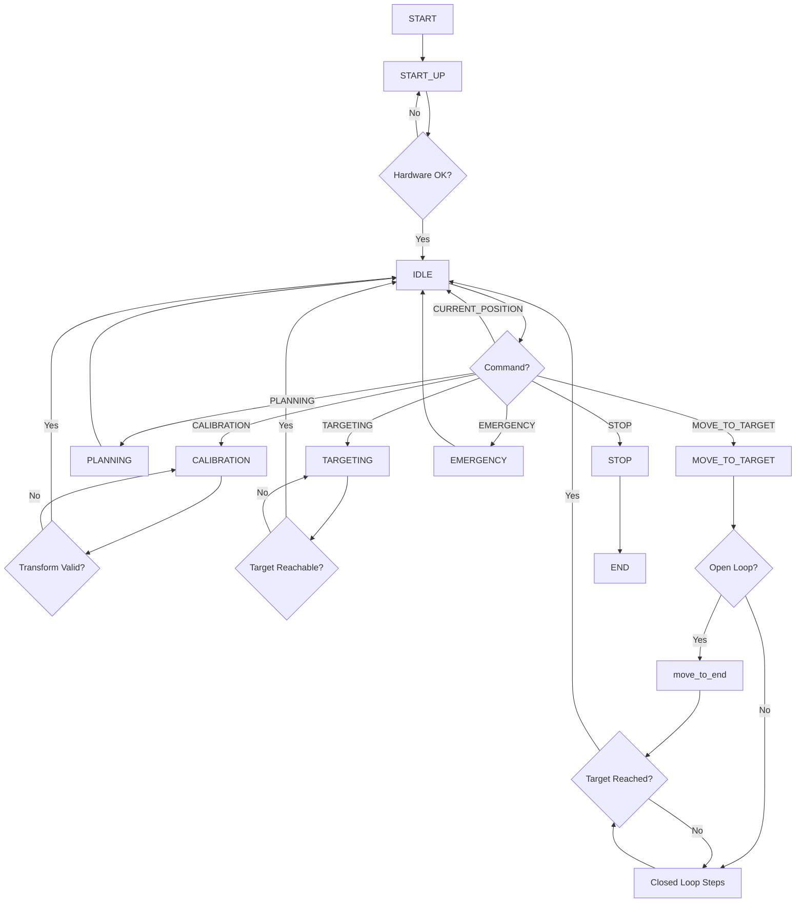

# BRP Robot MATLAB Control System - Detailed Documentation

## Table of Contents
1. [Overview](#overview)
2. [System Architecture](#system-architecture)
3. [Main Entry Point](#main-entry-point)
4. [Control Structure](#control-structure)
5. [Class Hierarchy](#class-hierarchy)
6. [State Machine Flow](#state-machine-flow)
7. [Control Methods](#control-methods)
8. [Directory Structure](#directory-structure)
9. [Setup and Installation](#setup-and-installation)
10. [Usage Guide](#usage-guide)
11. [Hardware Integration](#hardware-integration)
12. [Simulation Mode](#simulation-mode)

---

## Overview

This MATLAB project implements a comprehensive control system for a needle insertion robot used in prostate biopsy procedures. The system integrates with 3D Slicer via OpenIGTLink for surgical planning and provides real-time control of needle insertion, rotation, and positioning using hardware controllers (Arduino and Galil).

### Key Features
- **OpenIGTLink Integration**: Communicates with 3D Slicer for surgical planning and image guidance
- **State Machine Architecture**: Robust workflow management through discrete operational states
- **Dual Control Modes**: Supports both open-loop and closed-loop control strategies
- **Hardware Abstraction**: Interfaces with Arduino (rotation) and Galil (insertion) motor controllers
- **Simulation Capability**: Full simulation mode for testing without hardware
- **Real-time Feedback**: Extended Kalman Filter (EKF) for state estimation
- **Coordinate Transformation**: Handles registration between robot, image, and Z-frame coordinate systems

---

## System Architecture

```
┌─────────────────────────────────────────────────────────────┐
│                       3D Slicer (IGT Interface)             │
│                    OpenIGTLink Communication                │
└──────────────────────┬──────────────────────────────────────┘
                       │ TCP/IP (Port 18936)
                       ↓
┌─────────────────────────────────────────────────────────────┐
│                        Server Class                         │
│  - Command Processing (START_UP, CALIBRATION, etc.)        │
│  - State Management                                         │
│  - Message Routing                                          │
└──────────────────────┬──────────────────────────────────────┘
                       │ Inherits from
                       ↓
┌─────────────────────────────────────────────────────────────┐
│                        Robot Class                          │
│  - Needle Control Logic                                     │
│  - Motor Control                                            │
│  - Trajectory Planning                                      │
└──────────────────────┬──────────────────────────────────────┘
                       │ Inherits from
                       ↓
┌─────────────────────────────────────────────────────────────┐
│                     Kinematics Class                        │
│  - Forward/Inverse Kinematics                               │
│  - Coordinate Transformations                               │
└──────────────────────┬──────────────────────────────────────┘
                       │ Inherits from
                       ↓
┌─────────────────────────────────────────────────────────────┐
│                     igtl_utils Class                        │
│  - OpenIGTLink Message Handling                             │
│  - Socket Communication                                     │
└─────────────────────────────────────────────────────────────┘
                       │
                       ↓
┌─────────────────────────────────────────────────────────────┐
│                   Hardware Controllers                      │
│  Arduino (Rotation) │ Galil (Insertion)                    │
└─────────────────────────────────────────────────────────────┘
```

---

## Main Entry Point

### `main.m`

The main entry point is minimal and follows a simple initialization pattern:

```matlab
clc;
clear;
delete_all;  % Clean up existing connections and timers

% Initialize server with control mode selection
server = Server('open_loop', true, 'simulation', false);

% Start the main control loop
server.Run();
```

**Parameters:**
- `'open_loop'`: Boolean flag for control mode
  - `true`: Open-loop control (no real-time feedback correction)
  - `false`: Closed-loop control (uses sensor feedback)
- `'simulation'`: Boolean flag for hardware bypass
  - `true`: Simulation mode (no hardware required)
  - `false`: Normal mode (requires Arduino and Galil)

---

## Control Structure

### Control Architecture Overview

The control system operates on multiple levels with different update frequencies:

```
┌──────────────────────────────────────────────────────────┐
│                    Control Hierarchy                     │
├──────────────────────────────────────────────────────────┤
│  1. Main Loop (Server.Run)                               │
│     ↓ Event-driven state transitions                     │
│  2. State Handlers (onStartUp, onCalibration, etc.)      │
│     ↓ Initiates movement                                 │
│  3. Timer-based Control (Control_CB)                      │
│     ↓ Periodic @ Freq_ctrl_sec (0.2s default)           │
│  4. Motor Control Execution                              │
│     ↓ Direct hardware commands                           │
│  5. Hardware Response (Arduino/Galil)                    │
└──────────────────────────────────────────────────────────┘
```

### Control Parameters

**Timing Configuration** (defined in `Robot` class):
```matlab
Time_resolution = 0.1 sec       % Simulation time step
Freq_ctrl_sec = 0.2 sec         % Control loop period
Freq_sens_sec = 5 sec           % Sensor update period
delay_step_sec = 5 sec          % Sensor delay compensation
Freq_em_sec = 0.1 sec           % EM sensor frequency
```

**Motion Parameters**:
```matlab
Stabbing_Vel = 5 mm/sec         % Needle insertion velocity
omega_max = π rad/sec           % Maximum rotation speed
max_curvature = 0.001054        % Needle curvature (1/mm)
max_insertion_distance = 127 mm % Maximum depth
```

### Control Loop (`Control_CB`)

The `Control_CB` function is the core control callback executed by MATLAB timer at `Freq_ctrl_sec` intervals:

**Control Flow**:
```
1. Increment Control Step Counter
   ↓
2. Read Encoder Values (theta, insertion depth)
   ↓
3. Update Needle Pose from Sensors
   ↓
4. Apply Extended Kalman Filter (if enabled)
   ↓
5. Calculate Control Output (omega)
   - Feed-Forward (FF): Based on target geometry
   - Feed-Back Old (FB_old): Classic feedback control
   - Feed-Back New (FB_new): Advanced feedback algorithm
   ↓
6. Send Motor Commands
   - Rotation: Arduino via set_rpm_ino()
   - Insertion: Galil via move_insertion()
   ↓
7. Log Data to Arrays
   ↓
8. Check Termination Conditions
```

**Control Method Selection** (`CM` property):
- `CM = 0`: Feed-Forward (FF) - Uses pre-computed trajectory
- `CM = 1`: Feedback Old (FB_old) - Classic PID-like control
- `CM = 2`: Feedback New (FB_new) - Advanced model-based control

### Control Algorithm Details

**Feed-Forward Control** (`CM = 0`):
```matlab
% Uses kinematic model to compute required rotation
[k, P_tt, theta_d, omega_hat_pro] = Cal_k_P_tt_theta_d(
    P_tb1, T_tb, obj.Target_Pos_local, 
    obj.Stabbing_Vel, obj.k_max, obj.max_curvature);
omega = Cal_Omega(P_tt, theta_d, omega_hat_pro, ...);
```

**Feedback Control** (`CM = 1` or `CM = 2`):
```matlab
% Computes error between current and desired state
% Applies correction based on feedback
omega = Update_rot_dir(...);  % Adjusts rotation direction/speed
```

---

## Class Hierarchy

### 1. `igtl_utils` (Base Class)

**Purpose**: Handles OpenIGTLink communication protocol

**Key Properties**:
```matlab
host = '127.0.0.1'              % Server IP address
port = 18936                    % OpenIGTLink port
socket                          % TCP socket connection
sender                          % Message sender object
receiver                        % Message receiver object
```

**Key Methods**:
- `connect(host, port)`: Establish connection to 3D Slicer
- `disconnect()`: Clean disconnection
- `onRxStatusMessage()`: Callback for status messages
- `onRxStringMessage()`: Callback for string commands
- `onRxTransformMessage()`: Callback for transformation matrices

---

### 2. `Kinematics` Class

**Purpose**: Implements robot kinematics calculations

**Key Constants**:
```matlab
baseToNeedleGuideZ = 223.4 mm   % Base to needle guide distance
lengthTrapSideLink = 124.0 mm   % Trapezoid side length
widthTrapTop = 84.0 mm          % Trapezoid top width
distanceBetweenTraps = 181.5 mm % Front-rear trap distance
```

**Key Methods**:
- `ForwardKinematics(x1, x2, x3, x4, zIns, zRot)`: Compute needle tip pose
  - Inputs: 4 slider positions + insertion + rotation
  - Output: Transformation matrix (Base → Treatment point)
  
- `InverseKinematics(targetPose)`: Compute joint positions for target
  
- `ConvertFromRobotBaseToImager(robotPose)`: Coordinate transformation
  - Applies registration matrix
  - Transforms from robot base frame to image frame

**Kinematic Chain**:
```
Robot Base → Front Trapezoid → Rear Trapezoid → Needle Base → Needle Tip
     ↓            ↓                  ↓               ↓            ↓
   (0,0,0)    (xF, yF, zF)      (xR, yR, zR)    Insertion   Treatment
```

---

### 3. `Robot` Class

**Purpose**: Core robot control and needle insertion management

**State Properties**:
```matlab
current_mode          % 'startup', 'calibration', 'planning', 
                      % 'targeting', 'idle', 'move_to_goal', 'stop'
simulation_mode       % Hardware bypass flag
ESTOP                 % Emergency stop flag
is_target_reached     % Target achievement flag
```

**Hardware Objects**:
```matlab
arduino               % Arduino serial communication (rotation motor)
g                     % Galil controller (insertion motor)
t_control             % MATLAB timer for control loop
```

**Key Methods**:

**Initialization**:
- `Robot('simulation', false)`: Constructor with simulation option
- `startup()`: Initialize system, timers, data arrays, hardware
- `enable_simulation_mode()`: Switch to simulation without hardware

**Control Functions**:
- `Control_CB()`: Main timer callback (executes every `Freq_ctrl_sec`)
- `move_to_end()`: Execute full insertion with open-loop control
- `move_A_step(needle_pos_image)`: Single-step movement for closed-loop

**Registration & Planning**:
- `calibrate(zframe_transform)`: Register robot to image coordinates
- `planning(target)`: Path planning and reachability check
- `check_target(target)`: Validate target in workspace
- `reachable(target)`: Compute reachable target pose considering needle curvature

**Position Management**:
- `get_robot_current_pose()`: Current needle pose in image frame
- `set_entry_point(needle_image)`: Set insertion starting point
- `Send_Current_Position()`: Transmit pose to 3D Slicer

**Motor Control**:
- `home_insertion(home_pos, threshold)`: Return to home position
- Hardware commands wrapped with simulation checks

**Data Management**:
- `save_experiment_data(filename)`: Save all logged data to .mat file

---

### 4. `Server` Class

**Purpose**: High-level state machine and IGT communication manager

**State Flags**:
```matlab
calibration_finsh_flag   % Calibration completed
planning_finsh_flag      % Planning completed
targeting_finsh_flag     % Target validated
idle_flag                % In idle state
command_recieved         % Command pending
open_loop                % Control mode (true=open, false=closed)
```

**Valid Commands**:
```matlab
validCommands = ["START_UP", "CALIBRATION", "PLANNING", 
                 "TARGETING", "IDLE", "MOVE_TO_TARGET", 
                 "STOP", "EMERGENCY", "RETRACT_NEEDLE"]
```

**Key Methods**:

**Main Loop**:
- `Run()`: Infinite state machine loop processing commands from 3D Slicer

**State Handlers**:
- `onStartUp()`: Initialize robot hardware
- `onCalibration()`: Process Z-frame registration
- `onPlanning()`: Set planning mode (minimal processing)
- `onTargeting()`: Receive and validate target from Slicer
- `onIdle()`: Wait for next command, respond to position queries
- `onMove()`: Execute needle insertion (open or closed loop)
- `onRetractNeedle()`: Pull needle back to home
- `onStop()`: Clean shutdown
- `onEmergency()`: Immediate stop and safe state

---

## State Machine Flow

### Complete Workflow



### State Descriptions

**START_UP**:
- Initializes robot hardware (Arduino, Galil)
- Sets up timers and data structures
- Configures Kalman filter
- Transitions to IDLE when ready

**CALIBRATION**:
- Receives Z-frame transformation from 3D Slicer
- Computes registration matrix (Image ↔ Robot coordinates)
- Validates transformation
- Stores `registration_matrix` for all subsequent operations

**PLANNING**:
- Minimal processing state (placeholder for future planning algorithms)
- Currently just acknowledges and returns to IDLE

**TARGETING**:
- Receives target pose from 3D Slicer
- Performs reachability analysis considering:
  - Workspace limits
  - Needle curvature constraints
  - Collision avoidance
- If reachable, stores target and computes entry trajectory

**IDLE**:
- Waits for commands from 3D Slicer
- Responds to `CURRENT_POSITION` queries
- Acts as hub for state transitions

**MOVE_TO_TARGET**:
- **Open Loop Mode**: Calls `move_to_end()` for continuous insertion
  - Starts timer-based control loop
  - Monitors termination conditions
  - Logs all data
  
- **Closed Loop Mode**: Iterative `move_A_step()` calls
  - Receives needle tip pose from MRI tracking
  - Computes next step
  - Executes step
  - Returns current pose
  - Repeats until target reached

**STOP**:
- Clean shutdown of all systems
- Stops motors safely
- Closes communication
- Exits main loop

**EMERGENCY**:
- Sets `ESTOP = true`
- Immediately halts all motion
- Requires manual reset

---

## Control Methods

### Control Method Enumeration

Defined in `ControlMethod.m`:
```matlab
classdef ControlMethod < double
    enumeration
        FF (0)        % Feed-Forward
        FB_old (1)    % Feedback Old
        FB_new (2)    % Feedback New
    end
end
```

### Feed-Forward (FF) Control

**Theory**: Uses kinematic model to pre-compute rotation profile

**Algorithm**:
1. Compute required curvature vector to reach target
2. Calculate rotation angle `theta_d` to align curvature
3. Determine rotation velocity `omega` to achieve alignment

**Advantages**:
- No sensor feedback required
- Predictable behavior
- Suitable for straight insertions

**Disadvantages**:
- Sensitive to model errors
- Cannot compensate for tissue deflection

**Implementation**:
```matlab
% Calculate control parameters
[k, P_tt, theta_d, omega_hat_pro] = Cal_k_P_tt_theta_d(
    P_tb1, T_tb, Target_Pos_local, 
    Stabbing_Vel, k_max, max_curvature);

% Compute rotation velocity
omega = Cal_Omega(P_tt, theta_d, omega_hat_pro, 
                  Stabbing_Vel, omega_max, 
                  theta0, Freq_ctrl_sec, CM);
```

### Feedback Controls (FB_old, FB_new)

**Theory**: Uses real-time position feedback to correct trajectory

**Algorithm**:
1. Measure current needle tip position
2. Compute error from desired trajectory
3. Apply corrective rotation

**Advantages**:
- Robust to model uncertainties
- Compensates for tissue deformation
- Adaptive to changing conditions

**Disadvantages**:
- Requires reliable position sensing
- Susceptible to sensor noise
- Higher computational cost

**Implementation**:
```matlab
% Update rotation direction based on feedback
omega = Update_rot_dir(Needle_pose_act, Target_Pos_local,
                       T_tb, k_max, ...);
```

### Extended Kalman Filter (EKF)

**Purpose**: State estimation combining model prediction and sensor measurements

**State Vector**: `[x, y, z, gamma, phi, theta]` (6-DOF pose)

**Update Cycle**:
```matlab
if flag_ekf == 1
    [ekf, Needle_pose_ekf] = Update_EKF(
        ekf, Needle_pose_sensor, sensor_flag,
        omega_All, Stabbing_Vel, Freq_ctrl_sec,
        Ctrl_Step_num, delay_step_CtrlFreq);
    Needle_pose_act = Needle_pose_ekf;  % Use filtered estimate
else
    Needle_pose_act = Needle_pose_sensor;  % Use raw sensor
end
```

**Components**:
- `stateTransitionModel()`: Predicts next state based on control input
- `measurementFcn()`: Maps state to sensor measurements
- `Update_EKF()`: Performs prediction and correction steps

---

## Directory Structure

### `/classes/` - Object-Oriented Components

| File | Description |
|------|-------------|
| `Server.m` | Main state machine and IGT interface |
| `Robot.m` | Robot control and needle insertion logic |
| `Kinematics.m` | Forward/inverse kinematics calculations |
| `igtl_utils.m` | OpenIGTLink communication utilities |
| `ControlMethod.m` | Control method enumeration |
| `R_axis.m` | Rotation axis utilities |
| `CW_dir.m` | Clockwise direction enumeration |

### `/functions/` - Utility Functions

**Initialization**:
- `arduino_comm_init_motor.m`: Initialize Arduino for motor control
- `arduino_comm_init_encoder.m`: Initialize Arduino for encoder reading
- `delete_all.m`: Clean up serial ports, timers, parallel pools

**Motor Control**:
- `set_rpm_ino.m`: Set rotation motor RPM via Arduino
- `init_galil.m`: Initialize Galil motion controller
- `move_insertion.m`: Control insertion motor
- `stop_insertion.m`: Stop insertion motor
- `home_insertion.m`: Return to home position
- `get_encoder_insertion.m`: Read insertion encoder
- `get_encoder_tick.m`: Read rotation encoder

**Control Algorithms**:
- `Cal_k_P_tt_theta_d.m`: Calculate control parameters (curvature, direction)
- `Cal_Omega.m`: Compute rotation velocity
- `Update_rot_dir.m`: Update rotation direction for feedback control
- `Update_EKF.m`: Extended Kalman Filter update

**Kinematics**:
- `Cal_Ptb1_Ttb.m`: Calculate needle tip position and transformation
- `Cal_Rotation_Matrix.m`: Compute rotation matrices
- `inverseHomogeneousTransform.m`: Invert transformation matrix

**Trajectory & Planning**:
- `curvedNeedleTrajectory.m`: Generate curved needle trajectory
- `check_termination_condition_with_plane.m`: Check if target reached

**Conversions**:
- `encoder2theta.m`: Convert encoder ticks to angle
- `radsec2rpm.m`: Convert rad/s to RPM
- `euler2z.m`: Extract Euler angles
- `quaternion2x/y/z.m`: Quaternion to rotation conversions

**Kalman Filter**:
- `stateTransitionModel.m`: State prediction model
- `measurementFcn.m`: Measurement model
- `numericalJacobian_needle_A/B.m`: Jacobian calculations

**Visualization**:
- `plot_NeedleTrace3D.m`: 3D trajectory visualization
- `plot_Kalman_Observer.m`: Kalman filter performance plots

**Data Management**:
- `save_matfile.m`: Save experiment data
- `Gen_Generate_ResDir.m`: Generate results directory

### `/functions_tform/` - Transformation Utilities

- `Gen_pose2tform.m`: Convert pose to transformation matrix
- `Gen_tform2pose.m`: Convert transformation matrix to pose

### `/IGTL/` - OpenIGTLink Implementation

- `igtlConnect.m`: Establish IGT connection
- `igtlDisconnect.m`: Close IGT connection
- `igtlComputeCrc.m`: Compute CRC checksum
- `OpenIGTLinkMessageReceiver.m`: Message reception handler
- `OpenIGTLinkMessageSender.m`: Message transmission handler
- `testReceiveMessage.m`: Test receiving messages
- `testSendMessage.m`: Test sending messages

### `/kinematics_model/` - Kinematic Models

- `bicycleKinematicsModel.m`: Bicycle model for needle steering
- `bicycle_model_configurations.m`: Model parameter configurations
- `expSE3.m`, `expSO3.m`: Exponential map for Lie groups
- `toLieSE3.m`, `toLieSO3.m`: Convert to Lie algebra
- `fromLieSO3.m`: Convert from Lie algebra
- `apply_rotation.m`: Apply rotation to vector

### `/MoterControl/` - Motor Control Scripts

**Galil Control**:
- `init_galil.m`: Initialize Galil controller
- `insertion_test.m`: Test insertion motor
- `move_insertion.m`: Move insertion axis
- `stop_insertion.m`: Stop insertion
- `get_encoder_insertion.m`: Read encoder
- `home_insertion.m`: Homing routine
- `set_vel_volt.m`: Set velocity via voltage
- `set_rpm_pid.m`: Set RPM with PID control
- `disable_galil.m`: Safely disable Galil
- `record_home_pos.m`: Record home position

### `/Test_scripts/` - Test Programs

- `simple_reachability_test.m`: Test workspace reachability
- `test1.m`: General system test

### `/utils/` - General Utilities

- `Gen_Generate_ResDir.m`: Create results directory with timestamp
- `save_matfile.m`: Save data with proper formatting

---

## Setup and Installation

### Prerequisites

**Software**:
- MATLAB R2020b or later
- Required Toolboxes:
  - Instrument Control Toolbox (Arduino/Serial)
  - Control System Toolbox (Kalman Filter)
  - Robotics System Toolbox (Transformations)
- 3D Slicer with SlicerIGT extension

**Hardware** (for non-simulation mode):
- Arduino (rotation motor control) - typically COM4
- Galil DMC motion controller (insertion motor)
- Needle insertion robot with encoders

### Installation Steps

1. **Open MATLAB Project**:
   ```matlab
   % Navigate to the Matlab directory
   cd('c:\Users\yiwei\Documents\GitHub\BRPRobot2021\WPI\Matlab')
   
   % Open the project file to register all paths
   open('Matlab.prj')
   ```

2. **Verify Path Registration**:
   ```matlab
   % Check that all subdirectories are on the path
   path
   ```
   Should include: `classes/`, `functions/`, `IGTL/`, etc.

3. **Configure Hardware** (if using real hardware):
   - Connect Arduino to USB (note COM port)
   - Connect Galil via Ethernet
   - Update COM port in `Robot.m` if needed:
     ```matlab
     obj.arduino = arduino_comm_init_motor("COM4");  % Change COM4 if needed
     ```

4. **Start 3D Slicer IGT Server**:
   - Launch 3D Slicer
   - Open IGT interface module
   - Start server on port 18936 (default)

---

## Usage Guide

### Quick Start - Simulation Mode

**For testing without hardware**:

```matlab
% Clean environment
clc; clear; delete_all;

% Initialize in simulation mode
server = Server('open_loop', true, 'simulation', true);

% Run main loop
server.Run();
```

**Then in 3D Slicer**:
1. Send `START_UP` command
2. Send `CALIBRATION` with Z-frame transform
3. Send `PLANNING` 
4. Send `TARGETING` with target transform
5. Send `MOVE_TO_TARGET` to begin insertion

### Quick Start - Normal Mode

**With hardware connected**:

```matlab
% Clean environment
clc; clear; delete_all;

% Initialize with hardware
server = Server('open_loop', true, 'simulation', false);

% Run main loop
server.Run();
```

**Hardware Checklist**:
- ✓ Arduino connected and recognized (COM4)
- ✓ Galil controller powered and connected
- ✓ Encoders functional
- ✓ Motors respond to test commands
- ✓ Emergency stop accessible

### Control Mode Selection

**Open Loop** (Pre-planned trajectory):
```matlab
server = Server('open_loop', true, 'simulation', false);
```

**Closed Loop** (MRI feedback):
```matlab
server = Server('open_loop', false, 'simulation', false);
```

### Typical Workflow

1. **Startup Phase**:
   - System initializes hardware
   - Timers configured
   - Data arrays allocated
   - Transitions to IDLE

2. **Calibration Phase**:
   - Load medical image with Z-frame
   - Detect Z-frame fiducials in Slicer
   - Send Z-frame transform to MATLAB
   - Registration matrix computed

3. **Planning Phase**:
   - Identify target in image
   - (Currently minimal processing)

4. **Targeting Phase**:
   - Select target point in Slicer
   - Send target transform to MATLAB
   - Reachability analysis performed
   - Entry point computed

5. **Insertion Phase**:
   - **Open Loop**: 
     - MATLAB executes pre-computed trajectory
     - Monitors encoders for position
     - Logs all data
     - Stops at target depth
   
   - **Closed Loop**:
     - Slicer tracks needle tip in real-time MRI
     - Sends needle pose updates
     - MATLAB computes corrections
     - Adjusts rotation to compensate for deflection
     - Iterates until target reached

6. **Completion**:
   - Data saved to `data_all_*.mat`
   - System returns to IDLE
   - Can retract needle with `RETRACT_NEEDLE`

### Data Collection

After each insertion, data is automatically saved:

```matlab
% Saved in data_all.mat:
- omega_All                  % Control inputs (rotation velocity)
- Needle_pose_act_All        % Estimated needle pose
- Needle_pose_sensor_All     % Raw sensor measurements
- Target_Pos_local_All       % Target positions
- theta_encoder_All          % Encoder readings
- tick_insertion_All         % Insertion encoder ticks
- Time_Step                  % Time vector
- Ctrl_Time                  % Control timestamps
- Sensor_Time                % Sensor timestamps
```

**Loading Data**:
```matlab
% Load experiment results
load('data_all_0.mat');

% Plot trajectory
plot_NeedleTrace3D(Needle_pose_act_All, Target_Pos_local_All);

% Analyze control performance
figure; plot(Ctrl_Time, omega_All);
xlabel('Time [s]'); ylabel('Rotation Velocity [rad/s]');
```

---

## Hardware Integration

### Arduino (Rotation Control)

**Connection**:
- USB Serial (typically COM4)
- Baud rate: 9600 (configured in `arduino_comm_init_motor`)

**Functions**:
- `set_rpm_ino(arduino, rpm)`: Set rotation speed
- `get_encoder_tick(arduino)`: Read rotation encoder

**Protocol**:
```
Set RPM:   Send "S<rpm>\n" (e.g., "S100\n" for 100 RPM)
Get Tick:  Send "G\n", receive encoder count
```

### Galil Controller (Insertion Control)

**Connection**:
- Ethernet/TCPIP
- IP configured in `init_galil()`

**Functions**:
- `move_insertion(g, direction, voltage)`: Start insertion
  - `direction`: 0=retract, 1=insert
  - `voltage`: 0-10V proportional to speed
- `stop_insertion(g, direction)`: Stop motor
- `get_encoder_insertion(g)`: Read insertion encoder
- `home_insertion(g)`: Return to home position

**Galil Commands** (sent via `g.command()`):
```matlab
'MT 1,1,1'          % Set motors as servo
'JG A=<speed>'      % Set jog speed for axis A
'BG A'              % Begin motion on axis A
'ST A'              % Stop axis A
'TP A'              % Tell position of axis A (encoder count)
```

### Encoder Integration

**Rotation Encoder**:
- Read via Arduino
- Conversion: `encoder2theta(ticks, PPR, initialPulse)`
- Updates `obj.zRotation`

**Insertion Encoder**:
- Read via Galil
- Conversion: `abs(tick_insertion) / 5000 * 3` mm
- Updates `obj.zInsertion`

**Usage in Control Loop**:
```matlab
% In Control_CB()
encoder_read = get_encoder_tick(obj.arduino);
theta_encoder = encoder2theta(encoder_read, obj.PPR, initialPulse);
obj.zRotation = theta_encoder;

tick_insertion = get_encoder_insertion(obj.g);
obj.zInsertion = abs(tick_insertion) / 5000 * 3;
```

---

## Simulation Mode

### Enabling Simulation

**At Construction**:
```matlab
server = Server('open_loop', true, 'simulation', true);
```

**After Construction**:
```matlab
robot = Robot();
robot = robot.enable_simulation_mode();
robot = robot.startup();
```

### Simulation Behavior

**Hardware Initialization**:
- ✗ Skips `arduino_comm_init_motor()`
- ✗ Skips `init_galil()`
- ✓ Initializes all data structures
- ✓ Creates timers

**Motor Commands**:
```matlab
if ~obj.simulation_mode
    set_rpm_ino(obj.arduino, rpm);
else
    disp(['SIMULATION MODE: Would set motor RPM to ', num2str(rpm)]);
end
```

**Encoder Reading**:
```matlab
if ~obj.simulation_mode
    theta_encoder = encoder2theta(get_encoder_tick(obj.arduino), ...);
else
    obj.zRotation = 0;  % Simulated value
    obj.zInsertion = 5 * obj.Ctrl_Step_num;  % Linear increase
end
```

**Pose Updates**:
- Uses kinematic model with simulated joint values
- No real sensor feedback
- Predictable, repeatable behavior

### Testing with Simulation

**Test Control Algorithm**:
```matlab
% Set up simulation
server = Server('open_loop', true, 'simulation', true);
server.CM = 0;  % Test feed-forward control

% Set virtual target
server.Target_Pos_local = [10, 5, 100];  % [x,y,z] in mm

% Run insertion
server.move_to_end();

% Analyze results
load('data_all.mat');
plot_NeedleTrace3D(Needle_pose_act_All, Target_Pos_local_All);
```

**Test State Machine**:
```matlab
% Simulation allows testing IGT communication without hardware
server = Server('open_loop', true, 'simulation', true);
server.Run();

% In 3D Slicer, send commands and verify state transitions
```

---

## Advanced Topics

### Coordinate Systems

**Three primary coordinate systems**:

1. **Robot Base Frame**:
   - Origin: Robot base mounting point
   - Z-axis: Insertion direction
   - Units: mm

2. **Z-Frame (Calibration) Frame**:
   - Origin: Z-frame center
   - Defined by fiducial markers
   - Visible in CT/MRI images

3. **Image Frame** (3D Slicer):
   - Origin: Image volume origin
   - RAS coordinates (Right-Anterior-Superior)
   - Units: mm

**Registration Process**:
```matlab
% In calibrate() method:
obj.registration_matrix = zframe_transform * obj.robot_base_to_zframe;

% Usage in coordinate transformation:
robot_pose_image = obj.registration_matrix * robot_pose_base;
```

### Needle Curvature Model

**Bicycle Model**:
- Needle acts as bicycle with fixed curvature
- Curvature magnitude: `k_max = 0.001054 mm^-1`
- Curvature direction: Controlled by rotation angle `theta`

**Reachability Analysis**:
```matlab
% Considers:
% 1. Maximum curvature constraint
% 2. Workspace boundaries
% 3. Minimum insertion depth
% 4. Target location relative to entry point

function is_reachable = reachable(obj, target)
    % Compute required curvature vector
    % Check against k_max
    % Verify workspace constraints
end
```

### Kalman Filter Configuration

**State Vector**: `[x, y, z, gamma, phi, theta]`
- Position: (x, y, z) in mm
- Orientation: (gamma, phi, theta) in radians (Euler angles)

**Process Model**:
```matlab
% In stateTransitionModel.m
x_next = x + v * dt * cos(theta) * cos(gamma);
y_next = y + v * dt * cos(theta) * sin(gamma);
z_next = z + v * dt * sin(theta);
% ... orientation updates based on omega and curvature
```

**Measurement Model**:
```matlab
% In measurementFcn.m
% Assumes direct measurement of all 6 states
measurement = state + noise;
```

**Enabling EKF**:
```matlab
robot.flag_ekf = 1;  % Enable
robot.flag_ekf = 0;  % Disable (use raw sensor)
```

---

## Troubleshooting

### Common Issues

**Problem**: MATLAB can't find classes or functions
```matlab
% Solution: Re-open project file
open('Matlab.prj');

% Or manually add paths
addpath('classes', 'functions', 'IGTL', 'kinematics_model');
```

**Problem**: Arduino connection fails
```matlab
% Check available ports
serialportlist

% Update COM port in Robot.m
obj.arduino = arduino_comm_init_motor("COMx");  % Use correct port

% Test connection
arduino = arduino_comm_init_motor("COM4");
set_rpm_ino(arduino, 0);  % Should not error
```

**Problem**: Galil not responding
```matlab
% Test connection
g = init_galil();
response = g.command('MG TIME');  % Should return time
disp(response);

% Check IP in init_galil.m
```

**Problem**: Timer errors
```matlab
% Clean up existing timers
delete_all;

% Or manually:
timers = timerfindall;
stop(timers);
delete(timers);
```

**Problem**: 3D Slicer not connecting
```
1. Verify Slicer IGT server is running
2. Check port: 18936 (default)
3. Check firewall settings
4. Test with telnet: telnet 127.0.0.1 18936
```

---

## File Naming Conventions

**Experiment Data**:
- `data_all_0.mat` through `data_all_11.mat`: Experimental results
- `shared_data.mat`: Inter-process communication file

**Configuration**:
- `connect.last`: Last connection settings

---

## Contributing

When modifying this code:

1. **Maintain simulation compatibility**: Always wrap hardware calls with simulation checks
2. **Document state transitions**: Update state machine flow if adding states
3. **Log data**: Add new variables to `save_experiment_data()`
4. **Test both modes**: Verify in simulation AND hardware modes
5. **Update README**: Document new features or parameters

---

## References

- **OpenIGTLink Protocol**: http://openigtlink.org/
- **3D Slicer**: https://www.slicer.org/
- **Needle Steering**: Bicycle kinematic model papers
- **Project Repository**: ProstateBRP/BRPRobot2021

---

## Contact

For questions about this code, contact the WPI BRP Robot team.

**Last Updated**: December 2025
**Version**: WPI-MATLAB-integration branch
